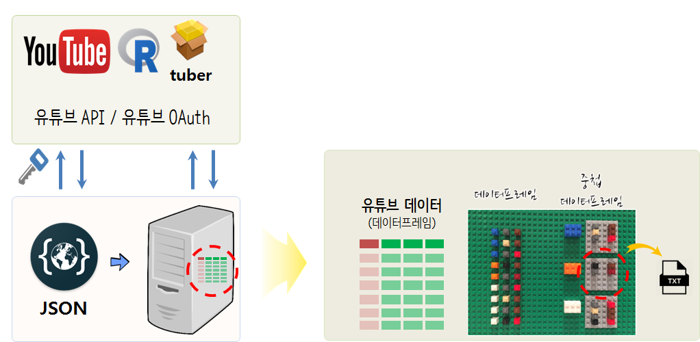

 
``` {r, include=FALSE}
# source("tools/chunk-options.R")

knitr::opts_chunk$set(echo = TRUE, warning=FALSE, message=FALSE,
                    comment="", digits = 3, tidy = FALSE, prompt = FALSE, fig.align = 'center')

```

# 튜토리얼 소개 {#tutorial-intro}

[자연어 처리의 민낯](https://songys.github.io/2019LangCon/)에서 "유튜브 댓글 텍스트 분석"을 주제로 튜토리얼을 시작합니다.

- R 개발자가 알아야 되는 보안
- 유튜브 API
- 유튜브 댓글 [자료구조](https://statkclee.github.io/parallel-r/r-parallel-fp-ds.html)
- SNS 트래픽 분석
- 탐색적 자연어 텍스트 분석
    - [네이버 뉴스](https://statkclee.github.io/text/nlp-naver-news.html)
- 모형
    - [SMS 스팸분류 - Random Forest](https://statkclee.github.io/text/nlp-spam-machine-learning.html)
    - [캐글 - 전자상거래 옷 리뷰](https://statkclee.github.io/text/text-kaggle-ecommerce-review.html)



# 클라우드 시대 보안키 [^cloud-key] {#cloud-key}

[^cloud-key]: [R 개발자가 알아야 되는 보안](https://statkclee.github.io/deep-learning/r-security.html)

1. R이 설치된 디렉토리를 탐색기를 통해 찾아간다.
    - `C:\Program Files\R\R-3.5.1\etc`
1. `Rprofile.site` 파일을 찾아 환경설정을 한다.

``` {r rprofile-site, eval=FALSE}
# Rprofile.site 파일
AWS_ACCESS_KEY_ID <-  "Axxx"
AWS_SECRET_ACCESS_KEY <- "pxxx"
```


# 유튜브 API [^google-cloud-api] {#tutorial-youtube-api}  

[^google-cloud-api]: [xwMOOC, "R 구글 애널리틱스(GA)"](https://statkclee.github.io/deep-learning/r-ga.html)

[xwMOOC, "R 구글 애널리틱스(GA)"](https://statkclee.github.io/deep-learning/r-ga.html) 참조하여 유튜브 API 데이터를 가져올 수 있도록 한다.


# SNS 트래픽 분석 [^tutorial-youtube-api] {#tutorial-youtube-api-eda}  

[^tutorial-youtube-api]: [xwMOOC, "유트브 댓글"](https://statkclee.github.io/text/nlp-youtube-comment.html)

[xwMOOC, "유트브 댓글"](https://statkclee.github.io/text/nlp-youtube-comment.html)

# 모형 {#tutorial-youtube-api-model}  
