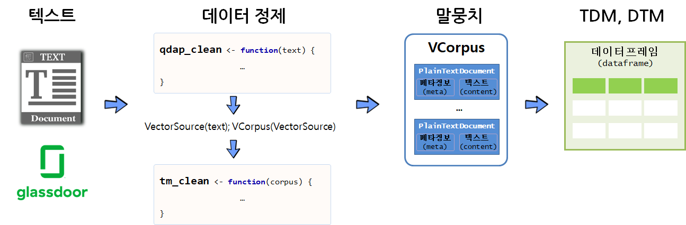

 
``` {r, include=FALSE}
# source("tools/chunk-options.R")

knitr::opts_chunk$set(echo = TRUE, warning=FALSE, message=FALSE,
                    comment="", digits = 3, tidy = FALSE, prompt = TRUE, fig.align = 'center')

library(here)

```


# 아마존 vs. 구글 평판 데이터 [^bag-of-words-google-vs-amazon] {#bag-of-words-amazon-vs-google}

[^bag-of-words-google-vs-amazon]: [William Surles (2017-09-25), "Text Mining: Bag of Words"](https://rpubs.com/williamsurles/316682)

본 학습내용은 [Ted Kwartler, "Text Mining: Bag of Words", DataCamp](https://www.datacamp.com/courses/intro-to-text-mining-bag-of-words)의 내용을 바탕으로 재작성한 것을 
밝혀둡니다. 

텍스트 데이터 분석 작업 흐름도 일반적인 데이터 분석 과정과 크게 차이가 나지는 않는다.

1. 문제 정의 및 목표설정: 적용분야 전문지식 습득 필요
1. 수집 텍스트 데이터 식별: 목표달성을 위한 정보가 담긴 데이터 발굴
1. 데이터 분석 및 모형 개발 과정
    * 텍스트 데이터 전처리 및 구조화
    * 데이터 정제 및 Feature 공학을 통한 Feature 추출 
    * 데이터 분석 및 모형 개발 : 탐색적 데이터 분석 포함
1. 분석결과 정리: 보고서, 추천, 통찰 도출


# 텍스트 마이닝 {#text-mining-bow}

## 문제정의 {#text-mining-bow-step-01}

데이터를 통해서 접근하려고 하는 문제를 다음과 같이 정의한다.

1. 온라인 리뷰에 따르면 아마존 혹은 구글 중 어느 회사가 더 좋은 연봉을 제공하는 이미지가 있는가?
1. 현재 고용된 직원의 익명 리뷰에 따르면 워라벨(일과 삶 균형)이 더 좋은 직장이 어느 곳인가?

## 텍스트 데이터 {#text-mining-bow-step-02}

포브스를 비롯한 가장 일하기 좋은 직장에 관한 기사가 심심치 않게 나오고 있고, 한국도 예외는 아니다.
매일경제 [대한민국 일하기 좋은 100대 기업 - "직원에게 기쁨 주는 회사...일자리도 쑥쑥 느네요"](http://news.mk.co.kr/newsRead.php?year=2017&no=744993)라는 기사가 
구글 검색에서 우선 나오네요.
미국의 경우 [Indeed](http://www.indeed.com/cmp/Amazon.com/reviews), [Glassdoor](http://www.glassdoor.com/), [CareerBliss](http://www.careerbliss.com/amazon/reviews/)가 있고,
국내의 경우 ["익명SNS 블라인드를 아시나요"...뒷담화 전성시대?](https://news.joins.com/article/19519738) 중앙일보 기사에 내용이 잘 정리되어 있다.

[William Surles (2017-09-25), "Text Mining: Bag of Words"](https://rpubs.com/williamsurles/316682) Rpubs 웹페이지에서 [glassdoor](https://www.glassdoor.com/) 아마존, 구글에 대한 리뷰를 받아볼 수 있다.

```{r amzn-google-dataset}
library(tidyverse)
amzn_df <- read_csv('https://assets.datacamp.com/production/course_935/datasets/500_amzn.csv')
goog_df <- read_csv('https://assets.datacamp.com/production/course_935/datasets/500_goog.csv')

# amzn_df %>% write_csv("data/amzn_df.csv")
# goog_df %>% write_csv("data/goog_df.csv")

amzn_df %>% 
    sample_n(3) %>% DT::datatable()
```

## 텍스트 데이터 구조화 {#text-mining-bow-step-03}

아마존과 구글에 대한 좋은 점과 나쁜 점에 대한 평판 텍스트 데이터가 수집되었다면, 
다음 단계로 텍스트 데이터 분석을 위해 데이터를 정제할 필요가 있다.



데이터프레임 구글과 아마존의 텍스트 데이터를 받아 `dqap`으로 텍스트 데이터를 바로 처리하고, 
`tm` 팩키지로 불용어 처리 등을 함께 처리하여 탐색적 텍스트 데이터 분석이 가능한 형태로 정제한다.

```{r text-data-organization}
library(qdap)
library(tm)
# qdap 텍스트 정제
qdap_clean <- function(x) {
  x <- replace_abbreviation(x)
  x <- replace_contraction(x)
  x <- replace_number(x)
  x <- replace_ordinal(x)
  x <- replace_symbol(x)
  x <- tolower(x)
  return(x)
}

# tm 말뭉치 생성
tm_clean <- function(corpus) {
  corpus <- tm_map(corpus, removePunctuation)
  corpus <- tm_map(corpus, stripWhitespace)
  corpus <- tm_map(corpus, removeWords, 
                   c(stopwords("en"), "Google", "Amazon", "company"))
  return(corpus)
}

```

### 아마존 - 장점과 단점 {#text-mining-bow-step-03-amazon}

먼저 아마존에 대해 `qdap` 팩키지 텍스트 데이터 정제기능을 활용하여 데이터를 정제한다.
추후 [RWeka](https://cran.r-project.org/web/packages/RWeka/index.html) 토큰화에 필요한 텍스트 데이터 정제과정도 함께 진행한다.
그리고 나서, `tm` 말뭉치를 생성하고 정제 작업도 함께 수행한다.

```{r nlp-text-organization-amazon}
# 아마존 장점과 단점
amzn_pros <- qdap_clean(amzn_df$pros)
amzn_cons <- qdap_clean(amzn_df$cons)

## NA를 NULL로 치환 - RWeka 토큰화 과정에 필요
amzn_pros[which(is.na(amzn_pros))] <- "NULL"
amzn_cons[which(is.na(amzn_cons))] <- "NULL"

# 코퍼스 생성
az_p_corp <- VCorpus(VectorSource(amzn_pros))
az_c_corp <- VCorpus(VectorSource(amzn_cons))

## 데이터 정제 코퍼스 생성
amzn_pros_corp <- tm_clean(az_p_corp)
amzn_cons_corp <- tm_clean(az_c_corp)
```

### 구글 - 장점과 단점 {#text-mining-bow-step-03-google}

구글에 대해서도 아마존과 동일한 과정을 거쳐서 후속 텍스트 데이터 분석을 위한 데이터 전처리 정제작업을 수행한다.

```{r nlp-text-organization-google}
# 아마존 장점과 단점
goog_pros <- qdap_clean(goog_df$pros)
goog_cons <- qdap_clean(goog_df$cons)

## NA를 NULL로 치환 - RWeka 토큰화 과정에 필요
goog_pros[which(is.na(goog_pros))] <- "NULL"
goog_cons[which(is.na(goog_cons))] <- "NULL"

# 코퍼스 생성
goog_p_corp <- VCorpus(VectorSource(goog_pros))
goog_c_corp <- VCorpus(VectorSource(goog_cons))

## 데이터 정제 코퍼스 생성
goog_pros_corp <- tm_clean(goog_p_corp)
goog_cons_corp <- tm_clean(goog_c_corp)
```


# 피처 추출과 분석 {#text-mining-bow-step-04-05}

텍스트 데이터 피처(Feature) 추출과 분석을 함께 진행한다. 먼저 uni-gram을 수행하고 
bi-gram 분석도 순차적으로 진행한다.

## 한철자(uni-gram) 분석  {#text-mining-bow-step-04-05}

한철자(uni-gram) 분석을 위해서 TDM을 생성한 후에 행렬로 변환 한 후에 빈도수 분석을 수행하고 이를 단어구름으로 시각화한다.

### 아마존 장점 {#text-mining-bow-step-04-05-amazon-pro}

아마존을 긍정리뷰에 등장횟수가 많은 단어를 추출하여 막대그래프와 단어 구름을 통해 시각화한다.

```{r nlp-text-organization-unigram-amzn}
library(wordcloud)
# TDM 생성
amzn_p_tdm <- TermDocumentMatrix(amzn_pros_corp)

# 행렬변환
amzn_p_tdm_m <- as.matrix(amzn_p_tdm)

# 빈도수 계산
amzn_p_freq <- rowSums(amzn_p_tdm_m)

# 막대그래프
amzn_p_freq %>% 
    as.data.frame() %>% 
    rownames_to_column(var="word") %>% 
    rename(frequency = '.') %>% 
    arrange(desc(frequency)) %>% 
    top_n(15, frequency) %>% 
    ggplot(aes(x=fct_reorder(word, frequency), y=frequency)) +
      geom_col() +
      coord_flip() +
      labs(x="단어 빈도", y="", title="아마존 긍정 단어 빈도")

# 단어구름 생성
wordcloud(names(amzn_p_freq),
  amzn_p_freq,
  max.words = 25, 
  color = "blue")
```

다음으로 유사한 단어를 하나로 묶어보자. 이를 위해서 군집분석을 수행하고 이를 수목도(dendrogram)으로 시각화한다.
단어가 25~70개 사이가 적절하고 그 이상이 되거나 그 이하가 되면 다른 방법을 찾아볼 것을 권장한다.
단어가 군집분석 수목도를 통해 적절한 단어수가 되도록 `removeSparseTerms()` 함수의 `sparse`인자값을 적절히 선택한다.
그리고 나서 `hclust` 함수로 군집분석을 수행하고 시각화를 위해 `dendextend` 팩키지를 사용하여 관심있는 단어를 묶어 채색하고 
군집 갯수에 따라 단어를 묶어낸다.

```{r nlp-text-organization-unigram-amzn-pros-dendrogram}
library(dendextend)
amzn_p_sparse_tdm <- removeSparseTerms(amzn_p_tdm, sparse = .97)

amzn_p_hc <- hclust(
  d = dist(amzn_p_sparse_tdm, method = "euclidean"), 
  method = "complete")

amzn_p_hc_dend <- as.dendrogram(amzn_p_hc)

# labels(amzn_p_hc_dend)
amzn_p_hc_dend <- branches_attr_by_labels(amzn_p_hc_dend, c("fast", "paced"), color="black")

plot(amzn_p_hc_dend)
rect.dendrogram(amzn_p_hc_dend, k=5, color="blue")
```


### 아마존 단점 {#text-mining-bow-step-04-05-amazon-cons}

아마존을 부정리뷰에 등장횟수가 많은 단어를 추출하여 막대그래프와 단어 구름을 통해 시각화한다.

```{r nlp-text-organization-unigram-amzn-cons}
# TDM 생성
amzn_c_tdm <- TermDocumentMatrix(amzn_cons_corp)

# 행렬변환
amzn_c_tdm_m <- as.matrix(amzn_c_tdm)

# 빈도수 계산
amzn_c_freq <- rowSums(amzn_c_tdm_m)

# 막대그래프
amzn_c_freq %>% 
    as.data.frame() %>% 
    rownames_to_column(var="word") %>% 
    rename(frequency = '.') %>% 
    arrange(desc(frequency)) %>% 
    top_n(15, frequency) %>% 
    ggplot(aes(x=fct_reorder(word, frequency), y=frequency)) +
      geom_col() +
      coord_flip() +
      labs(x="단어 빈도", y="", title="아마존 단점 단어 빈도")

# 단어구름 생성
wordcloud(names(amzn_c_freq),
  amzn_c_freq,
  max.words = 25, 
  color = "red")
```

아마존 단점을 언급한 리뷰에 대한 단어 군집분석도 유사하게 진행한다.

```{r nlp-text-organization-unigram-amzn-cons-dendrogram}
amzn_c_sparse_tdm <- removeSparseTerms(amzn_c_tdm, sparse = .97)

amzn_c_hc <- hclust(
  d = dist(amzn_c_sparse_tdm, method = "euclidean"), 
  method = "complete")

amzn_c_hc_dend <- as.dendrogram(amzn_c_hc)

# labels(amzn_c_hc_dend)
amzn_c_hc_dend <- branches_attr_by_labels(amzn_c_hc_dend, c("bad", "really"), color="red")

plot(amzn_c_hc_dend)
rect.dendrogram(amzn_c_hc_dend, k=5, color="red")
```


### 구글 장점 {#text-mining-bow-step-04-05-google-pro}

구글을 긍정리뷰에 등장횟수가 많은 단어를 추출하여 막대그래프와 단어 구름을 통해 시각화한다.

```{r nlp-text-organization-unigram-google-pro}
# TDM 생성
goog_p_tdm <- TermDocumentMatrix(goog_pros_corp)

# 행렬변환
goog_p_tdm_m <- as.matrix(goog_p_tdm)

# 빈도수 계산
goog_p_freq <- rowSums(goog_p_tdm_m)

# 막대그래프
goog_p_freq %>% 
    as.data.frame() %>% 
    rownames_to_column(var="word") %>% 
    rename(frequency = '.') %>% 
    arrange(desc(frequency)) %>% 
    top_n(15, frequency) %>% 
    ggplot(aes(x=fct_reorder(word, frequency), y=frequency)) +
      geom_col() +
      coord_flip() +
      labs(x="단어 빈도", y="", title="구글 긍정 단어 빈도")

# 단어구름 생성
wordcloud(names(goog_p_freq),
  goog_p_freq,
  max.words = 25, 
  color = "blue")
```

### 구글 단점 {#text-mining-bow-step-04-05-google-cons}

구글을 부정리뷰에 등장횟수가 많은 단어를 추출하여 막대그래프와 단어 구름을 통해 시각화한다.

```{r nlp-text-organization-unigram-goog-cons}
# TDM 생성
goog_c_tdm <- TermDocumentMatrix(goog_cons_corp)

# 행렬변환
goog_c_tdm_m <- as.matrix(goog_c_tdm)

# 빈도수 계산
goog_c_freq <- rowSums(goog_c_tdm_m)

# 막대그래프
goog_c_freq %>% 
    as.data.frame() %>% 
    rownames_to_column(var="word") %>% 
    rename(frequency = '.') %>% 
    arrange(desc(frequency)) %>% 
    top_n(15, frequency) %>% 
    ggplot(aes(x=fct_reorder(word, frequency), y=frequency)) +
      geom_col() +
      coord_flip() +
      labs(x="단어 빈도", y="", title="구글 단점 단어 빈도")

# 단어구름 생성
wordcloud(names(goog_c_freq),
  goog_c_freq,
  max.words = 25, 
  color = "red")
```


## 두철자(bi-gram) 분석  {#text-mining-bow-step-04-05-bigram}

한철자(uni-gram) 분석을 확장하여 두철자를 분석해 보자.
이를 위해서 앞서 아껴둔 RWeka 팩키지 토큰화 함수를 사용한다.

### 아마존 장단점 {#text-mining-bow-step-04-05-amazon-pro-bigram}

먼저 아마존 장단점을 한번에 볼 수 있는 단어구름을 생성한다.
`NGramTokenizer` 함수를 사용해서 두철자 단어 빈도수를 계산한다.
이어서 단어구름에 넣어 아마존 장단점에 대한 시각화를 동시에 한다.

```{r nlp-text-organization-unigram-amzn-bigram}
library(RWeka)
# 토큰화
tokenizer <- function(x) {
    NGramTokenizer(x, Weka_control(min = 2, max = 2))
}

# 장점 -----
## TDM 생성
amzn_p_bi_tdm <- TermDocumentMatrix(amzn_pros_corp, 
                                    control = list(tokenize = tokenizer))

## 행렬변환
amzn_p_bi_tdm_m <- as.matrix(amzn_p_bi_tdm)

## 빈도수 분석
amzn_p_bi_freq <- rowSums(amzn_p_bi_tdm_m)

# 단점 -----
## TDM 생성
amzn_c_bi_tdm <- TermDocumentMatrix(amzn_cons_corp, 
                                    control = list(tokenize = tokenizer))

## 행렬변환
amzn_c_bi_tdm_m <- as.matrix(amzn_c_bi_tdm)

## 빈도수 분석
amzn_c_bi_freq <- rowSums(amzn_c_bi_tdm_m)

# 장단점 단어구름 -----
par(mfrow=c(1,2))
## 단어구름 시각화
wordcloud(names(amzn_p_bi_freq),
  amzn_p_bi_freq,
  max.words = 25, 
  color = "blue")

wordcloud(names(amzn_c_bi_freq),
  amzn_p_bi_freq,
  max.words = 25, 
  color = "red")
```

## 단어 연관성 {#word-associatin-bag-of-words}

`findAssocs()` 함수로 특정 단어 "fast paced"와 연관된 단어를 추출하고, 이를 `igraph`를 통해 시각화도 가능하다.

```{r word-association-bag-of-words}
library(igraph)
sort(amzn_p_bi_freq, decreasing=TRUE)[1:5]
sort(amzn_c_bi_freq, decreasing=TRUE)[1:5]

pros_associations <- findAssocs(amzn_p_bi_tdm, "fast paced", 0.23)

list_vect2df(pros_associations, col2 = "word", col3="score") %>% 
    arrange(desc(score)) %>% 
    DT::datatable()

par(mfrow=c(1,1))

amzn_g <- graph.data.frame(list_vect2df(pros_associations, col2 = "word", col3="score"), directed = TRUE)

plot(amzn_g, 
     edge.arrow.size=.2, 
     edge.color="orange",
     vertex.color="dark gray", 
     vertex.frame.color="#ffffff",
     vertex.label=V(amzn_g)$name, vertex.label.color="black") 

```


## 사내 장단점 비교 {#word-associatin-bag-of-words-comparison}

사내 장단점 비교를 위해서 `comparison.cloud`를 사용해서 구글의 장담점, 아마존의 장단점을 파악해 보자.

### 구글 장단점 {#word-associatin-bag-of-words-comparison-google}

구글의 장단점 리뷰를 한데 묶어 말뭉치를 만들고 TDM 으로 변환하여 `comparison.cloud`에 넣어 장단점을 시각화한다.

```{r word-associatin-bag-of-words-comparison-google}
## qdap 텍스트 정제
goog_df$qdap_pros <- qdap_clean(goog_df$pros)
goog_df$qdap_cons <- qdap_clean(goog_df$cons)

## tm 텍스트 정제
goog_corpus <- VCorpus(VectorSource(goog_df[,5:6]))
goog_corp <- tm_clean(goog_corpus)

## TDM 변환
goog_tdm <- TermDocumentMatrix(goog_corp)
colnames(goog_tdm) <- c("Goog_Pros", "Goog_Cons")

goog_m <- as.matrix(goog_tdm)

## 비교단어구름 시각화
comparison.cloud(goog_m,
  colors = c("#F44336", "#2196f3"),
  max.words = 100)
```


### 아마존 장단점 {#word-associatin-bag-of-words-comparison-amazon}

아마존의 장단점 리뷰를 한데 묶어 말뭉치를 만들고 TDM 으로 변환하여 `comparison.cloud`에 넣어 장단점을 시각화한다.

```{r word-associatin-bag-of-words-comparison-amazon}
## qdap 텍스트 정제
amzn_df$qdap_pros <- qdap_clean(amzn_df$pros)
amzn_df$qdap_cons <- qdap_clean(amzn_df$cons)

## tm 텍스트 정제
amzn_corpus <- VCorpus(VectorSource(amzn_df[,5:6]))
amzn_corp <- tm_clean(amzn_corpus)

## TDM 변환
amzn_tdm <- TermDocumentMatrix(amzn_corp)
colnames(amzn_tdm) <- c("Amazon_Pros", "Amazon_Cons")

amzn_m <- as.matrix(amzn_tdm)

## 비교단어구름 시각화
comparison.cloud(amzn_m,
  colors = c("#F44336", "#2196f3"),
  max.words = 100)
```

## 회사간 비교 {#word-associatin-bag-of-words-comparison-between}

장점과 단점을 회사간 비교를 위해서 `pyramid.plot`를 사용해서 구글과 아마존을 비교해서 우열을 파악해보자.

### 긍정 {#word-associatin-bag-of-words-comparison-between-pros}

아마존과 구글 긍정리뷰를 데이터프레임으로 생성해서 데이터 정제작업을 수행하고 두철자(bigram) 토큰화과정을 거쳐
TDM을 생성해서 행렬로 변환시킨다.

```{r amazon-google-pros-dataset}
pros_df <- data.frame(
  amzn_pros = c(as.character(amzn_df$pros), 'NULL'),
  goog_pros = as.character(goog_df$pros),
  stringsAsFactors = FALSE
)

pros_df[is.na(pros_df)] <- "NULL"
pros_df <- qdap_clean(pros_df)

all_pros_corpus <- VCorpus(VectorSource(pros_df))
all_pros_corp <- tm_clean(all_pros_corpus)

all_pros_tdm <- TermDocumentMatrix(
  all_pros_corp,
  control = list(tokenize = tokenizer)
)

all_pros_tdm_m <- as.matrix(all_pros_tdm)
```

TDM 행렬을 데이터프레임으로 변환하여 두 회사간 차이를 계산한다. 
차이가 큰 단어 15개를 추출하여 `pyramid.plot()`에 넣어 시각화한다.

```{r amazon-google-pros-dataset-viz}
library(plotrix)
top_df <- all_pros_tdm_m %>% as.data.frame %>% 
    rownames_to_column(var="words") %>% 
    tbl_df %>% 
    rename(amazon_pro = `1`,
           google_pro = `2`) %>% 
    filter(amazon_pro != 0,
           google_pro !=0) %>% 
    mutate(diff = abs(amazon_pro - google_pro)) %>% 
    top_n(15, diff)


# Create the pyramid plot
pyramid.plot(top_df$amazon_pro, top_df$google_pro, 
             labels = top_df$words, 
             gap = 12, 
             top.labels = c("Amzn", "Pro Words", "Google"), 
             main = "Words in Common", unit = NULL)
```


### 부정 {#word-associatin-bag-of-words-comparison-between-cons}

동일하게 아마존과 구글 부정리뷰를 데이터프레임으로 생성해서 데이터 정제작업을 수행하고 두철자(bigram) 토큰화과정을 거쳐
TDM을 생성해서 행렬로 변환시킨다.

```{r amazon-google-cons-dataset}
cons_df <- data.frame(
  amzn_cons = c(as.character(amzn_df$qdap_cons), 'NULL'),
  goog_cons = as.character(goog_df$qdap_cons),
  stringsAsFactors = FALSE
)

cons_df$amzn_cons[which(is.na(cons_df$amzn_cons))] <- "NULL"
cons_df$goog_cons[which(is.na(cons_df$goog_cons))] <- "NULL"

all_cons_corpus <- VCorpus(VectorSource(cons_df))
all_cons_corp <- tm_clean(all_cons_corpus)

all_cons_tdm <- TermDocumentMatrix(
  all_cons_corp,
  control = list(tokenize = tokenizer)
)

all_cons_tdm_m <- as.matrix(all_cons_tdm)
```

TDM 행렬을 데이터프레임으로 변환하여 두 회사간 차이를 계산한다. 
차이가 큰 단어 15개를 추출하여 `pyramid.plot()`에 넣어 시각화한다.

```{r amazon-google-cons-dataset-viz}
top_cons_df <- all_cons_tdm_m %>% as.data.frame %>% 
    rownames_to_column(var="words") %>% 
    tbl_df %>% 
    rename(amazon_con = `1`,
           google_con = `2`) %>% 
    filter(amazon_con != 0,
           google_con !=0) %>% 
    mutate(diff = abs(amazon_con- google_con)) %>% 
    top_n(15, diff)


# Create the pyramid plot
pyramid.plot(top_cons_df$amazon_con, top_cons_df$google_con, 
             labels = top_cons_df$words, 
             gap = 12, 
             top.labels = c("Amzn", "Con Words", "Google"), 
             main = "Words in Common", unit = NULL)
```

# 결론 {#bag-of-words-conclusiong}

단어주머니 텍스트 데이터 분석을 통해서 구글이 워라밸이 아마존보다 좋은 듯 싶다.
아마존 인사담당자는 학습능력이 뛰어나고 성장할 수 있는 기회가 많이 주어지나 상대적으로 업무강도가 센 직업을 선호하는 사람을 직원으로 채용하는 것을 추천한다.