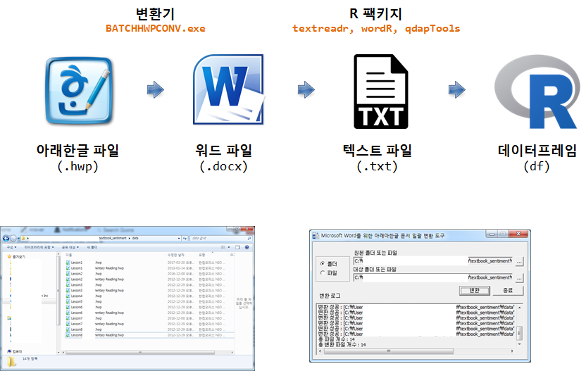

 
``` {r, include=FALSE}
source("tools/chunk-options.R")
knitr::opts_knit$set(verbose = FALSE, echo=FALSE, message=FALSE, warning =FALSE)

# devtools::install_github("richierocks/rebus")
library(tidyverse)
library(tidytext)
library(qdap)
library(qdapTools)
library(stringr)
library(tm)
library(lexicon)
library(magrittr)
library(purrr)

clean_text <- function(text){
    text <- tolower(text)
    # text <- removeNumbers(text)
    # text <- bracketX(text)
    text <- replace_number(text)
    text <- replace_abbreviation(text)
    text <- replace_contraction(text)
    text <- replace_symbol(text)
    text <- removePunctuation(text)
    text <- stripWhitespace(text)
    text <- str_replace_all(text, "americans", "america")
    
    indexes <- which(text == "")
    if(length(indexes) > 0){
        text <- text[-indexes]
    } 
    return(text)
}
```

## 1. 중고등 영어 교과서 {#english-textbook}

초증등 영어교과서의 디자인을 제거하고 순수하게 텍스트만 추출해서 영문 교과서에 담겨진 감성을 뽑아내 보자.



1. 압축이 되어 있으면 압축을 풀어 한 곳에 모아 놓는다.
1. [HwpConverter.exe](https://www.microsoft.com/ko-kr/download/details.aspx?id=36772) 파일을 다운로드 받아 설치를 하면 아래한글 파일을 워드 파일로 변환할 수 있다.
    - 변환기 실행파일은 %Program Files%\Microsoft Office\Office15 즉, `C:\Program Files\Microsoft Office\Office15` 디렉토리에 위치하고 파일명은 **BATCHHWPCONV.EXE**을 실행한다.
1. `qdapTools` 팩키지 `read_docx()` 함수로 워드 파일을 R 객체로 불러들인다.

## 2. 영어 교과서 감성분석 {#english-textbook-sentiment}

### 2.1. 교과서 가져오기 {#english-import}

``` {r textbook-import}

# library(tidyverse)
# library(tidytext)
# library(qdap)
# library(qdapTools)
# library(stringr)
# library(tm)
# library(lexicon)
# library(magrittr)
# library(purrr)

# 1. 데이터 가져오기 ------------
## 1. 교과서 모든 레슨 가져오기

tb_lesson <- list.files("data/", pattern = "Lesson[0-9]_Reading.docx")

tb_lesson_files <- paste0("data/", tb_lesson)

tb_lesson_lst <- map(tb_lesson_files, read_docx)

listviewer::jsonedit(tb_lesson_lst)
```

### 2.2. 교과서 전처리 {#english-preprocess}

``` {r textbook-preprocess}

## 2. 데이터 전처리 --------------

tb_lesson_lst <- map(tb_lesson_lst, clean_text)

tb_lesson_dat <- enframe(tb_lesson_lst, name="lesson", value ="txt")

tb_lesson_df <- tb_lesson_dat %>% 
    mutate(text = map(txt, paste, collapse=" ")) %>% 
    select(lesson, text)
```

### 2.3. 교과서 감성분석 {#english-sentiment}

``` {r textbook-sentiment}
## 3. 감성분석 --------------

tb_pol <- tb_lesson_df %$% polarity(text)

polarity(tb_lesson_df$text)

# counts(tb_pol) %>% 
#     DT::datatable(extensions = 'FixedColumns',
#                   options = list(
#              autowidth = TRUE,
#              columnDefs = list(list(width = '10px', targets = 1:5),
#                                list(width = '500px', targets = 6))
#         ))

plot(tb_pol)
```