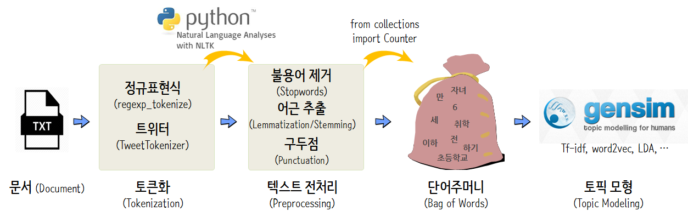

 
``` {r, include=FALSE}
# source("tools/chunk-options.R")

knitr::opts_chunk$set(echo = TRUE, warning=FALSE, message=FALSE,
                    comment="", digits = 3, tidy = FALSE, prompt = FALSE, fig.align = 'center')

```

# 정규표현식 &rarr; 단어주머니 {#nlp-regex}

텍스트가 주어진 경우 `nltk`, `collections` 팩키지를 조합해서 
정규표현식을 기반으로 토큰으로 만든 후에 전처리 과정을 거쳐 단어주머니를 생성시킨다.


## 토큰화(Tokenization) {#nlp-token}

**토큰화(Tokenization)**는 문자열, 문장, 문서를 토큰(token, 작은 덩어리)으로 바꾸는 과정이다.
예를 들어, 구두점(punctuation)을 기준으로 구분을 하거나, 단어 혹은 문장 단위로 나누거나, 트위터의 경우 
해쉬태그(`#`) 단위로 쪼개는 것도 가능하다.

토큰화를 하는 이유는 다음과 같다. 

- 품사(Part of Speech, POS)를 수울히 매핑할 수 있다.
- 불용어 매칭
- 원치않는 토큰을 제거

파이썬에서는 `sent_tokenize`, `regexp_tokenize`, `TweetTokenizer` 같은 Tokenizer가 팩키지로 제공된다.

- `sent_tokenize`: 문장(sentence) 단위 토큰화
- `regexp_tokenize`: 정규표현식 패턴을 반영한 토큰화
- `TweetTokenizer`: 트위터 특성(`#` 해쉬태그, `@` 언급 등)을 반영한 토큰화 

`nltk` 팩키지 `nltk.tokenize`를 통해 `sent_tokenize`, `regexp_tokenize`, `TweetTokenizer` 메쏘드를 가져와서 사용할 수 있다.

## 데이터 전처리(preprocessing) {#nlp-preprocessing}

텍스트를 토큰으로 쪼개 놓게 되면 다음 단계로 각 토근에 대해서 적절한 전처리작업을 취해야 된다.
영어의 경우 대문자를 소문자로 변화시킨고, 어근을 추출하고, 불용어(`the`, `a` 등)를 제거하고 
구두점(`,`, `?` 등)을 제거하고 경우에 따라서는 불필요한 토큰도 제거한다.

- 대문자를 소문자 변환
- 어근 추출(Lemmatization/Stemming)
- 불용어 제거(Stopwords)
- 구두점(Punctuation)


## 단어주머니(Bag of words) {#nlp-bow}

텍스트에 대한 전처리 작업이 끝난 경우 `collections` 팩키지 `Counter()` 메쏘드를 사용해서 단어주머니를 생성시킨다.


# 단어주머니 &rarr; 통계 분석 [^lucy-park-gensim] {#nlp-analysis}

[^lucy-park-gensim]: [Eunjeong (Lucy) Park, Data Scientist, "한국어와 NLTK, Gensim의 만남"](https://www.slideshare.net/lucypark/nltk-gensim)

단어 벡터(Word Vector): Word vectors are multi-dimensional mathematical representations of words created using deep learning methods. They give us insight into relationships between words in a corpus.
Co-occurrence: 두 단어가 정해진 구간 내에서 동시에 등장함.
Collocation(연어): 인접하게 빈번하게 등장하는 단어 ("Data" + "Science")



