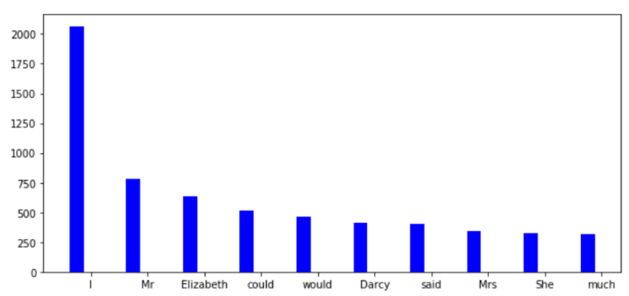
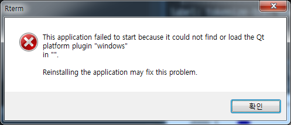

 
``` {r, include=FALSE}
# source("tools/chunk-options.R")

knitr::opts_chunk$set(echo = TRUE, warning=FALSE, message=FALSE,
                    comment="", digits = 3, tidy = FALSE, prompt = FALSE, fig.align = 'center')

```

# 정규표현식 &rarr; 단어주머니 {#nlp-regex}

텍스트가 주어진 경우 `nltk`, `collections` 팩키지를 조합해서 
정규표현식을 기반으로 토큰으로 만든 후에 전처리 과정을 거쳐 단어주머니를 생성시킨다.


RStudio IDE에서 R마크다운 파일로 파이썬 코드를 실행하기 위한 환경을 설정하자.

```{r python-setup}
library(reticulate)
use_condaenv("anaconda3")
```


## `nltk` 환경설정  {#nlp-regex-nltk-download}

표제어 추출(Lemmatization)을 위해서 `nltk` `wordnet`을 다운로드하여 설치한다.
`Lemma`는 한글로 번역하면 '표제어' 또는 '기본 사전형 단어' 의미로 Lemmatization(표제어 추출)은 단어들로부터 이 표제어를 찾아는 과정이다. 반면에 어간 추출(Stemming)은 Stem(어간)을 추출하는 작업을 Stemming이라고 한다. [^deep-learning-nlp] 

[^deep-learning-nlp]: [딥 러닝을 이용한 자연어 처리 입문, "어간 추출(Stemming) and 표제어 추출(Lemmatization)](https://wikidocs.net/21707)

|   어간 추출(Stemming)   | 표제어 추출(Lemmatization) |
|-------------------------|----------------------------|
| am &rarr; am            | am &rarr; be               |
| the going &rarr; the go | the going &rarr; the going |
| having &rarr; hav       | having &rarr; have         |

```{python download-nltk}
import nltk
nltk.download('punkt')     # 토큰으로 쪼개기
nltk.download('stopwords') # 불용어
nltk.download('wordnet')   # 표제어 추출

```

## 텍스트 파일 [^nlp-dataset] {#nlp-regex-import}

[^nlp-dataset]: [Jason Brownlee (September 27, 2017), "Datasets for Natural Language Processing"](https://machinelearningmastery.com/datasets-natural-language-processing/)

[The Project Gutenberg EBook of Pride and Prejudice, by Jane Austen](https://www.gutenberg.org/files/1342/1342.txt) 웹사이트에서 텍스트를 다운로드 받아 `data/` 디렉토리에 저장하고 파이썬으로 불러와서 첫 5줄을 출력한다.

```{python import-text}
## 텍스트 파일 --> 문자열로 변환
with open('data/Pride_and_Prejudice_1342.txt', 'r') as jane_austin:
    novel = jane_austin.read()

print(novel[:100])
```


## 토큰화(Tokenization) {#nlp-token}

**토큰화(Tokenization)**는 문자열, 문장, 문서를 토큰(token, 작은 덩어리)으로 바꾸는 과정이다.
예를 들어, 구두점(punctuation)을 기준으로 구분을 하거나, 단어 혹은 문장 단위로 나누거나, 트위터의 경우 
해쉬태그(`#`) 단위로 쪼개는 것도 가능하다.

토큰화를 하는 이유는 다음과 같다. 

- 품사(Part of Speech, POS)를 수월히 매핑할 수 있다.
- 불용어 매칭
- 원치않는 토큰을 제거

파이썬에서는 `sent_tokenize`, `regexp_tokenize`, `TweetTokenizer` 같은 Tokenizer가 팩키지로 제공된다.

- `sent_tokenize`: 문장(sentence) 단위 토큰화
- `regexp_tokenize`: 정규표현식 패턴을 반영한 토큰화
- `TweetTokenizer`: 트위터 특성(`#` 해쉬태그, `@` 언급 등)을 반영한 토큰화 

`nltk` 팩키지 `nltk.tokenize`를 통해 `sent_tokenize`, `regexp_tokenize`, `TweetTokenizer` 메쏘드를 가져와서 사용할 수 있다.

`type()` 함수로 파이썬 객체 자료형을 확인할 수 있다.
`set()` 함수를 사용해서 유일무이한 토큰 갯수를 확인할 수 있다.

```{python tokenize-text}
## 문자열 --> 토큰 추출
from nltk.tokenize import word_tokenize
from nltk.tokenize import regexp_tokenize

### 워드 토큰
word_tokens = word_tokenize(novel)

### 정규표현식 토큰
token_pattern = r"\w+"
regex_tokens = regexp_tokenize(novel, token_pattern)

print(u"유일무이한 토큰 갯수: ", len(set(word_tokens)),  "단어 토큰: ", len(word_tokens))
print(u"유일무이한 토큰 갯수: ", len(set(regex_tokens)), "정규표현식 토큰: ", len(regex_tokens))
print(word_tokens[:5])
print(regex_tokens[:5])

```

## 데이터 전처리(preprocessing) {#nlp-preprocessing}

텍스트를 토큰으로 쪼개 놓게 되면 다음 단계로 각 토근에 대해서 적절한 전처리작업을 취해야 된다.
영어의 경우 대문자를 소문자로 변화시킨고, 어근을 추출하고, 불용어(`the`, `a` 등)를 제거하고 
구두점(`,`, `?` 등)을 제거하고 경우에 따라서는 불필요한 토큰도 제거한다.

- 대문자를 소문자 변환
- 어근 추출(Lemmatization/Stemming)
- 불용어 제거(Stopwords)
- 구두점(Punctuation)

```{python tokenize-text-preprocessing}
## 토큰 전처리
from nltk.corpus import stopwords
from nltk.stem import WordNetLemmatizer

stop_words = set(stopwords.words('english')) 

# 알파벳만 추출
alpha_regex_tokens = [t for t in regex_tokens if t.isalpha()]

# 불용어 정리
alpha_regex_no_stops_tokens = [t for t in alpha_regex_tokens if t not in stop_words]

# WordNetLemmatizer 생성자
wordnet_lemmatizer = WordNetLemmatizer()

# Lemmatize all tokens into a new list: lemmatized
alpha_regex_no_stops_lemmatized_tokens = [wordnet_lemmatizer.lemmatize(t) for t in alpha_regex_no_stops_tokens]

print(alpha_regex_no_stops_lemmatized_tokens[:10])
```


## 단어주머니(Bag of words) {#nlp-bow}

텍스트에 대한 전처리 작업이 끝난 경우 `collections` 팩키지 `Counter()` 메쏘드를 사용해서 단어주머니를 생성시킨다.


```{python tokenize-text-bow}
from collections import Counter

novel_bow = Counter(alpha_regex_no_stops_lemmatized_tokens)

# 최빈값 10개 단어 추출
print(novel_bow.most_common(10))

```


## 단어빈도 시각화 [^bow-barplot] {#nlp-bow-matplotlib}

[^bow-barplot]: [stackoverflow - "plot most frequent words in python "](https://stackoverflow.com/questions/38805341/plot-most-frequent-words-in-python)

최비값 단어를 `matplotlib`으로 시각화하자. [stackoverflow - "plot most frequent words in python "](https://stackoverflow.com/questions/38805341/plot-most-frequent-words-in-python)을 참조하여 제인 오스틴 소설 "오만과 편견"에 가장 많이 회자되는 단어를 상위 10개를 추출하여 시각화한다.

```{python tokenize-text-bow-matplotlib, eval=FALSE}
import matplotlib.pyplot as plt
import numpy as np

## 상위 10개 단어 추출
top10_novel_bow = novel_bow.most_common(10)

## 10개 단어 시각화를 위한 기반 작업
n_groups = len(top10_novel_bow)
index = np.arange(n_groups)

## 단어빈도수와 단어 리스트 자료형 준비
bow_vals = [x[1] for x in top10_novel_bow]
bow_words = [x[0] for x in top10_novel_bow]

## 막대그래프 시각화

bar_width = 0.25

plt.bar(index, bow_vals, bar_width, color='b', label='Ocurrences')
plt.xticks(index + bar_width, bow_words)

plt.tight_layout()
plt.show()

```

다음과 같이 시각화가 결과가 R마크다운에 포함되어 렌더링되어야 하는데... Qt 오류가 발생되는 경우 우회하는 방법으로 `reticulate` 파이썬 객체를 R객체로 바꾸어 `ggplot`으로 시각화한다.



# 파이썬 시각화 오류 {#nlp-bow-matplotlib-error}

윈도우 환경에서 `matplotlib`을 활용하여 시각화할 경우 `this application failed to start because it could not find or load the qt platform plugin windows`와 같은 오류가 발생하는 경우가 있다.




# 파이썬 객체 &rarr; R객체 &rarr; `ggplot` {#nlp-bow-matplotlib-error-ggplot}

파이썬 객체를 R로 가져와서 시각화를 위해서 데이터프레임으로 변환시킨다.
그리고 나서 `ggplot` 문법에 맞춰 시각화한다.

```{r python-matplotlib-ggplot, eval=FALSE}
library(tidyverse)
library(extrafont)
loadfonts()

py$top10_novel_bow %>% 
  enframe %>%  
  mutate(word = map_chr(value, 1),
         count = map_int(value, 2)) %>% 
  ggplot(aes(x=fct_reorder(word, count), y=count, fill=word)) +
    geom_col() +
    coord_flip() +
    labs(x="", y="단어 빈도수", title="오만과 편견에 가장 많이 등장하는 단어") +
    theme_light(base_family = "NanumGothic") +
    scale_y_continuous(labels=scales::comma) +
    theme(legend.position = "none")
```

