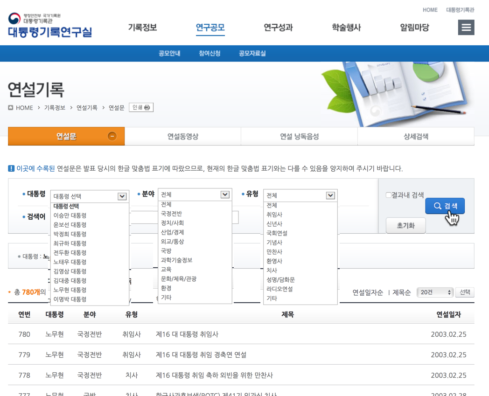
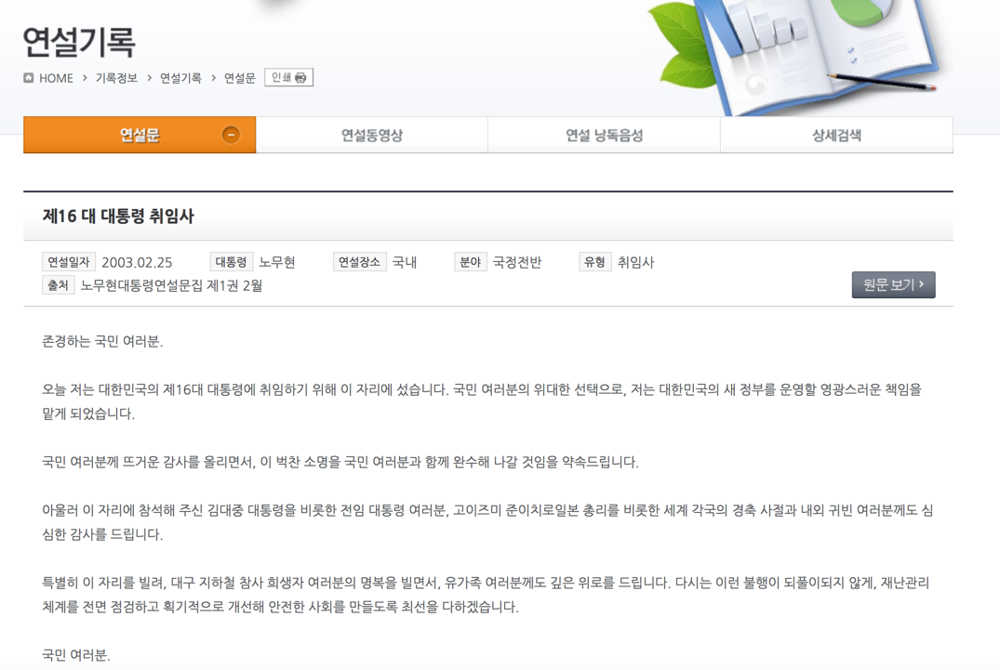

 
``` {r, include=FALSE}
source("tools/chunk-options.R")
knitr::opts_knit$set(verbose = FALSE, echo=FALSE, message=FALSE, warning =FALSE)

library(tidyverse)
library(rvest)
library(RmecabKo)
library(stringr)
library(purrr)
library(KoNLP)
useNIADic()
```

## 1. R Meetup 한글 텍스트 데이터 분석 발표자료 {#nlp-r-meetup}

R Meetup에서 류충현님이 발표한 대한민국 대통령 연설문 발표내용이 PDF 파일, html 파일 형태로 공개되어 `github` 사이트에 공유합니다.
발표내용이 실하고 한글 텍스트 분석에 대해 그대로 따라하면서 역량을 배가하고자 가능하면 원문 그대로 자동화에 맞춰 따라해 봤습니다.

## 2. 대통령 연설문 데이터 수집 {#nlp-president-speech-crawl}

전임 대통령의 연설문은 홈페이지 [행정안전부 국가기록원 대통령기록관](http://www.pa.go.kr)을 통해 대국민에게 공유되고 있으며, 
그 상세 주소는 [http://www.pa.go.kr/research/contents/speech/index.jsp](http://www.pa.go.kr/research/contents/speech/index.jsp)다.
참고로 미국 대통령 연설문은 동영상, 음성, 텍스트를 한번에 확인할 수 있도록 사용자 인터페이스가 잘 정리되어 공개되어 있다.

- 대한민국: [대통령기록관 - 대통령기록연구실 연설기록](http://www.pa.go.kr/research/contents/speech/index.jsp)
- 미국: [UVA-Miller Center: The Presidency / Presidential Speeches](https://millercenter.org/the-presidency/presidential-speeches)

연설문 수집은 **R**을 이용할 것이며, 크롤링이 가능한 여러 패키지가 있겠으나 `rvest` 패키지를 사용할 것이다. 
또한 전임 대통령 중에서  "김대중", "이명박", "노무현" 대통령에 한정해서 연설문을 수집하기로 한다.

### 2.1 연설문 목록 정보 추출하기 {#nlp-president-speech-crawl-target}

목록 조회 화면에서 대통령별로 목록 조회 `http://www.pa.go.kr/research/contents/speech/index.jsp?pageIndex=1&presidents=노무현` 처럼 
URL을 생성해서 `read_html()` 함수로 html을 읽어온 후 목록 페이지 개수를 산정한다. 
이후 pageIndex 값에 페이지 번호를 순차적으로 기술하면서, 
페이지만큼 반복을 통해서 `html_nodes()` 함수 등을 이용하여 연설문 정보를 추출하여 파일 이름을 생성한다.



### 2.1. 연설문 내용 추출하기 {#nlp-president-speech-crawl-content}

목록을 기준으로 파일명을 만든 후 연설문을 상세보기할 수 있는 URL을 추출하여 다음 그림과 같은 연설문을 추출하여 
“data” 디렉토리에 파일로 저장한다. 
연설문은 목록 파싱과정에서 제목 컬럼에 `http://www.pa.go.kr/research/contents/speech/index.jsp?spMode=view&catid=c_pa02062&artid=1309347`과 같은 구조의 링크를 호출하여, 
`read_html()` 함수로 html을 읽어온 후 `html_nodes()` 함수 등일 이용해서 연설문의 내용을 추출한다.



데이터를 수집하면 다음 그림처럼 `data` 디렉토리에 연설문들이 개별 파일로 저장된다.
RStudio 프로젝트로 생성하고 분석할 데이터를 `data` 디렉토리에 넣어 일반적인 데이터 분석 프로젝트와 동일하게 처리하고자 `speech` 디렉토리를 `data` 디렉토리로 변경함.


``` {r president-speech-import, eval=FALSE}
# 0. 환경설정 -------------
library(tidyverse)
library(rvest)
library(stringr)
library(RmecabKo) # devtools::install_github("junhewk/RmecabKo")
# install_mecab("D:/Rlibs/mecab")
library(tidytext)

# 0.1. R 환경의 OS 구하기

get_os <- function(){
  sysinf <- Sys.info()
  if (!is.null(sysinf)){
    os <- sysinf['sysname']
    if (os == 'Darwin')
      os <- "osx"
  } else { ## mystery machine
    os <- .Platform$OS.type
    if (grepl("^darwin", R.version$os))
      os <- "osx"
    if (grepl("linux-gnu", R.version$os))
      os <- "linux"
  }
  tolower(os)
}

# 0.2. 환경변수 설정

os <- get_os()
encode <- ifelse(os=="windows", "cp949", "utf-8")

path <- "data"
if (!dir.exists(path)) dir.create(path)

damPst <- c("김대중", "이명박", "노무현")

URL0 <- "http://www.pa.go.kr/research/contents/speech/index.jsp"

# 1. 연설문 가져오기 -----------------

for (person in damPst) {
  URL <- sprintf("%s?pageIndex=1&damPst=%s", URL0, person)
  
  pageTxt <- read_html(URL)
  pages <- html_nodes(pageTxt, "form#frm div.boardPage li") %>%
    html_children %>%
    .[length(.)] %>%
    html_attrs %>%
    unlist %>%
    .[2] %>%
    gsub(pattern = "[^[:digit:]]", replace = "") %>%
    as.integer
  
  for (i in 1:pages) {
    URL <- sprintf("%s?pageIndex=%s&damPst=%s", URL0, i, person)
    
    tableTxt <- read_html(URL)
    page <- html_nodes(tableTxt, "form#frm tbody") %>%
      html_children() 
    
    for (j in 1:length(page)) {
      #Sys.sleep(1)
      
      # 테이블의 컬럼값 추출
      fnames <- page[j] %>%
        html_nodes("td") %>%
        html_text %>%
        iconv(from = "utf-8", to = encode)
      
      # 연설문 분야에서 '/' 문자 변경
      fnames[3] <- fnames[3] %>%
        gsub(pattern = "/", replacement = "-")
      
      # 연설문 유형에서 '/' 문자 변경
      fnames[4] <- fnames[4] %>%
        gsub(pattern = "/", replacement = "-")
      
      # 연설문 제목에서 특수문자 제거
      fnames[5] <- fnames[5] %>%
        gsub(pattern = "[[:punct:]]", replacement = "")
      
      # 연설문 날짜의 포맷 변경
      fnames[6] <- fnames[6] %>%
        gsub(pattern = "\\.", replacement = "-")
      
      fname <- fnames[-1] %>%
        paste(collapse = "_") %>%
        paste("txt", sep = ".") %>%
        paste(path, ., sep = "/")
      
      # 연설문보기 링크의 value 부분 발췌
      value <- page[j] %>%
        html_nodes("a") %>%
        .[1] %>%
        html_attr(name = "href")
      
      # 연설문 가져오기
      URL <- sprintf("%s%s", URL0, value)
      contentTxt <- read_html(URL)
      
      contents <- html_nodes(contentTxt, "div#content div.conTxt") %>%
        html_text %>%
        iconv(from = "utf-8", to = encode) %>%
        gsub(pattern = "[[:cntrl:]]", replacement = "") 
      
      # 연설문을 파일에 쓰기
      zz <- file(fname, "wt", encoding = "utf-8")
      cat(contents, file = zz)
      close(zz)
    }
  }
}
```

### 2.2. 파일 데이터를 데이터 프레임으로 전환하기 {#nlp-president-speech-to-dataframe}

파일로 저장된 연설문 데이터를 데이터 프레임 객체로 변환한다.

Mac의 파일시스템은 UTF-8-MAC 인코딩을 따른다. `iconv(from ="utf-8-mac", to = "utf-8")` 명령어를 사용한다.
눈으로 보기에는 한글이 정상적으로 보이지만 정규표현식의 매칭이 되지 않는다. 
그래서 파일 이름을 조회한 후에 인코딩 변환을 수행해야 한다.

맥에서는 `ls` 명령어로 웹에서 긁어온 파일 목록을 준비할 수 있으나, 윈도우에서는 인코딩을 고려하여 목록을 준비해야만 된다.
`system("cmd.exe /c dir /W data", intern = TRUE)`와 같이 한 이유는 윈도우에서 바로 `dir`이 실행되지 않아 `cmd.exe /c` 로 윈도우 쉘 명령어를 실행하고 나서
파일 목록만 필요하기 때문에 `/W` 인자를 `dir` 명령어 뒤에 넣어주고 마지막으로 대통령 연설문 데이터가 저장된 `data/` 디렉토리를 지정한다.

윈도우 시스템에서 `readtext`로 텍스트 데이터를 불러읽어오는 경우, [readtext examples broken for Windows #105](https://github.com/kbenoit/readtext/issues/105) 오류가 있다.
따라서, `readLines()` 함수로 이를 대체해서 연설내용을 데이터프레임에 붙여넣는다.

``` {r president-speech-to-dataframe, eval=FALSE}
# 2. 연설문 데이터프레임 변환 -----------------

fname <- system("cmd.exe /c dir /W data", intern = TRUE)
fname <- fname[8:2417]
fname2 <- strsplit(fname, "_")

speech_df <- data.frame(president = sapply(fname2, "[", 1),
                        category = sapply(fname2, "[", 2),
                        type = sapply(fname2, "[", 3),
                        title = sapply(fname2, "[", 4),
                        date = sub("\\.txt", "", sapply(fname2, "[", 5)))

# 데이터 프레임에 연설내용 붙이기
speech_df$doc <- map_chr(paste("data", fname, sep="/"), readLines, encoding="UTF-8")

speech_df <- data.frame(docid = sprintf("DOC_%04d", seq(NROW(speech_df))), speech_df)

speech_df %>% head %>% 
  DT::datatable()
```

``` {r president-speech-to-dataframe-run, echo=FALSE}
speech_df <- readRDS("data/speech_df.rds")
speech_df %>% head %>% 
  DT::datatable()
```

## 3. R MeCab 설치 및 성능비교 {#nlp-president-speech-mecab}

### 3.1. R MeCab 설치  {#nlp-president-speech-mecab-install}

RMeCab 패키지는 MeCab 형태소 분석기를 인터페이스하는 패키지다. 
MeCab 형태소 분석기는 일본에서 개발된 오픈소스로 국내에서는 **은전한닢** 프로젝트로 한글 형태소 분석기로 포팅하여 배포되고 있다.

윈도우에서 설치에 어려움이 많았는데, 최근 [RmecabKo](https://github.com/junhewk/RmecabKo) 프로젝트로 윈도우에서 다음 두가지 명령어로 사용이 가능해졌다.

- `devtools::install_github("junhewk/RmecabKo")`
- `install_mecab("D:/Rlibs/mecab")`


``` {r presidential-speeches-mecab}
# 3. R MeCab 설치 및 성능비교 ----------
# devtools::install_github("junhewk/RmecabKo")
# install_mecab("D:/Rlibs/mecab")

# library(RmecabKo)
# library(KoNLP)
# useNIADic()
```

### 3.2. `KoNLP`, `RmecabKo` 수행 속도 비교  {#nlp-president-speech-mecab-speed}

국내 R 유저들이 많이 사용하고 있는 KoNLP와 비교해서 일장일단이 있는데, 
가장 큰 장점은 MeCab 형태소 분석기가 C++ 기반으로 만들어져서 Java 기반의 한나눔 형태소 분석기를 인터페이스한 KoNLP에 비해서 속도가 비약적으로 빠르다.

``` {r presidential-speeches-mecab-speed}
## 3.1. 속도 비교 데이터

doc <- "노약자를 비롯한 소외받는 사람들에게 더 많은 관심을 기울이는 따뜻한 사회를 만들어야 합니다. 이를 위해 복지정책을 내실화하고자 합니다. 모든 종류의 불합리한 차별을 없애 나가겠습니다. 양성평등사회를 지향해 나가겠습니다. 개방화 시대를 맞아 농어업과 농어민을 위한 대책을 강구하겠습니다. 고령사회의 도래에 대한 준비에도 소홀함이 없도록 하겠습니다. 반칙과 특권이 용납되는 시대는 이제 끝나야 합니다. 정의가 패배하고 기회주의자가 득세하는 굴절된 풍토는 청산되어야 합니다. 원칙을 바로 세워 신뢰사회를 만듭시다. 정정당당하게 노력하는 사람이 성공하는 사회로 나아갑시다. 정직하고 성실한 대다수 국민이 보람을 느끼게 해드려야 합니다."

doc5 <- paste(doc, doc, doc, doc, doc)

## 3.2. 속도 비교 데이터

result <- microbenchmark::microbenchmark(SimplePos22(doc5), pos(doc5))
result

ggplot2::autoplot(result)
```

### 3.3. `KoNLP`, `RmecabKo` 수행 성능 비교 - **띄어쓰기**  {#nlp-president-speech-mecab-performance}

한나눔 형태소 분석기는 띄어쓰기 문법을 지키지 않은 문장에 대해서 형태소 분석을 제대로 수행하지 못하지만, 
MeCab 형태소 분석기는 띄어쓰기 문법에 자유로워서 띄어쓰기 품질이 좋지 못한 텍스트 분석에 유리하다.

`KoNLP`와 `RMeCab` 팩키지 형태소분석 작업을 수행한다.

#### 3.3.1. 띄어쓰기가 정상인 문장

<div class = "row">
<div class = "col-md-6">
**`KoNLP`**

``` {r konlp-mecab-normal-konlp}
str1 <- "아버지가 방에 들어가신다."
map_df(SimplePos22(str1), str_c)
```

</div>
<div class = "col-md-6">
**RmecabKo**

``` {r konlp-mecab-normal-mecab}
map(pos(str1), str_c)
```
</div>
</div>


#### 3.3.2. 띄어쓰기가 비정상인 문장

<div class = "row">
<div class = "col-md-6">
**`KoNLP`**

``` {r konlp-mecab-normal-konlp2}
str2 <- "아버지가방에들어가신다."
map_df(SimplePos22(str2), str_c)
```

</div>
<div class = "col-md-6">
**RmecabKo**

``` {r konlp-mecab-normal-mecab2}
map(pos(str2), str_c)
```
</div>
</div>


#### 3.3.3. 띄어쓰기가 형편없는 문서의 띄어쓰기 보정

<div class = "row">
<div class = "col-md-6">
**`KoNLP`**

``` {r konlp-mecab-normal-konlp3}
str3 <- "못찾겠다. 꾀꼬리 꾀꼬리 나는야 오늘도 술래."
map_df(SimplePos22(str3), str_c)
```

</div>
<div class = "col-md-6">
**RmecabKo**

``` {r konlp-mecab-normal-mecab3}
map(pos(str3), str_c)
```
</div>
</div>

#### 3.3.4. 띄어쓰기 비정상적인 문장

<div class = "row">
<div class = "col-md-6">
**`KoNLP`**

``` {r konlp-mecab-normal-konlp4}
str4 <- "못찾 겠다.꾀꼬 리꾀꼬리나는 야오 늘도술래."
map_df(SimplePos22(str4), str_c)
```

</div>
<div class = "col-md-6">
**RmecabKo**

``` {r konlp-mecab-normal-mecab4}
map(pos(str4), str_c)
```
</div>
</div>

#### 3.3.5. 모든 문자를 붙인 문장

<div class = "row">
<div class = "col-md-6">
**`KoNLP`**

``` {r konlp-mecab-normal-konlp5}
str5 <- "못찾겠다.꾀꼬리꾀꼬리나는야오늘도술래."
map_df(SimplePos22(str5), str_c)
```

</div>
<div class = "col-md-6">
**RmecabKo**

``` {r konlp-mecab-normal-mecab5}
map(pos(str5), str_c)
```
</div>
</div>


