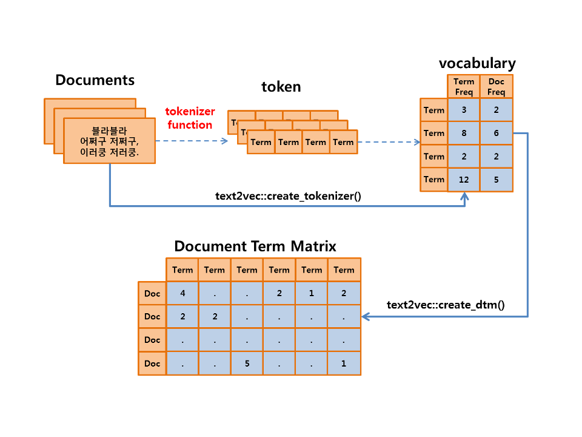
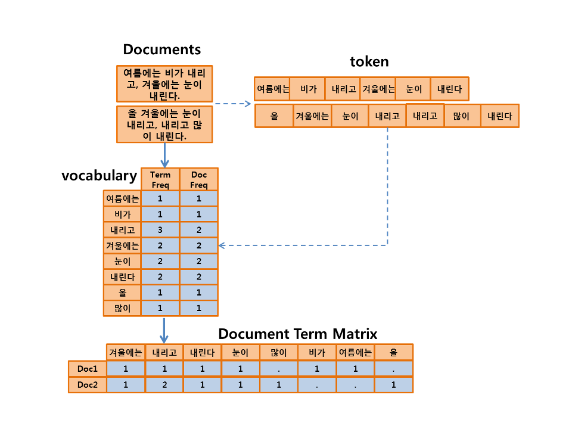

 
``` {r, include=FALSE}
source("tools/chunk-options.R")
knitr::opts_knit$set(verbose = FALSE, echo=FALSE, message=FALSE, warning =FALSE)

library(tidyverse)
library(rvest)
library(RmecabKo)
library(stringr)
library(purrr)
library(KoNLP)
useNIADic()
library(text2vec)
library(glmnet)

speech_df <- readRDS("data/speech_df.rds")
```

## 1. R Meetup 한글 텍스트 데이터 분석 발표자료 {#nlp-r-meetup-2}

R Meetup에서 류충현님이 발표한 대한민국 대통령 연설문 발표내용이 PDF 파일, html 파일 형태로 공개되어 `github` 사이트에 공유합니다.
발표내용이 실하고 한글 텍스트 분석에 대해 그대로 따라하면서 역량을 배가하고자 가능하면 원문 그대로 자동화에 맞춰 따라해 봤습니다.

- [R Meetup 저장소](https://github.com/KaggleBreak/xwmooc_Rmeetup)

## 2. 문서단어행렬(DTM) {#nlp-dtm}

모델링을 위해서 비정형데이터인 문서(documents) 텍스트 데이터를 벡터(vector)로 변환해야 한다. 
이 경우 엄청난 데이터의 증가가 필연적으로 따라온다. 
그래서 연산 속도의 개선을 위해서 벡터화(vectorization) 구조로 연산을 해야하기 때문에 
벡터화(Vectorization) 연산을 수행하기 위한 구조로 변환해야 한다. 

최종 구조는 **문서단어행렬(DTM, Document Term Matrix)**로 다음 그림과 같은 과정으로 생성한다.




이해를 돕기 위해서 문서(documents) 두 개를 DTM으로 변환하는 과정을 다음 그림으로 설명한다.



## 3. 문서단어행렬(DTM) 생성 {#nlp-dtm-creation}

### 3.1. 빈도(Frequency) 기반의 DTM 생성 {#nlp-dtm-creation-frequency}

리눅스나 맥에서 문서(documents)를 벡터로 변환하는 낱말분석(tokenizer)는 RMeCab 패키지를 이용해서 명사로 정의했다. 
최근 `RmecabKo` 팩키지를 활용해서 명사만 추출도 가능하다.
주로 RMeCab 패키지는 Mac과 Linux 환경에서만 수행되며, 사전에 MeCab이라는 일본의 오픈소스 형태소분석기를 모태로 은전한닢이라는 한글 형태소분석기를 설치해야 한다.

그래서 여기서는 단어(words)를 추출하는 낱말분석기(tokenizer)를 사용한다. 
그런데 명사로 만들어진 term보다는 words 단위의 term으로 만들어진 모델의 성능이 더 높게 나타났다. 
물론 모든 분석에서 아니겠지만, 형태소분석이 아닌 띄어쓰기 단위이 words의 term도 나름 의미가 있을 수 있다.

tokenizer가 명사가 아닌 words를 추출할 경우에는 term의 개수가 증가하기 때문에 상대적으로 vector의 원소 개수가 증가하게된다.


``` {r speech-tokenizer-word-frequency}
# 2. 데이터 전처리 ------------------
## 2.1. 낱말추출(tokenizer)
tok_fun <- word_tokenizer

speech_df_token <- itoken(speech_df$doc, 
                   tokenizer = tok_fun, 
                   ids = speech_df$docid, 
                   progressbar = TRUE)

speech_df_vocab <- create_vocabulary(speech_df_token)
speech_df_vectorizer <-  vocab_vectorizer(speech_df_vocab)
speech_dtm <- create_dtm(speech_df_token, speech_df_vectorizer)

dim(speech_dtm)
```

## 4. 연설문 저자 예측모형 {#nlp-dtm-glm}

### 4.1. 정규화 선형회귀모형 (Regularized Regression) {#nlp-dtm-glm-with-lasso}

관측치 개수에 배해서 독립변수 개수가 크면 과적합(overfiting) 문제가 발생된다. 그리고 회귀계수가 과도하게 증가하는 경향이 있다. 회귀계수가 과도하게 증가하지 않게 하기 위해서 비용(cost) 함수를 최소화하는 조건으로 회귀계수 도출하는 방법에 정규화 선형회귀모형이 있다.

정규화 선형회귀모형은 익히 알고 있는 잔차의 제곱합을 가장 작게 만드는 최소제곱법의 조건에 조건을 추가하며, 그 조건에 따라서 다음과 같은 세 가지의 방법을 사용한다.

- Ridge regression
- LASSO (Least Absolute Shrinkage Selector Operator) regression
- Elastic Net regression


정규화 선형회귀모형의 cost 함수와 특징은 다음과 같다.

- Ridge regression
    - cost = $\sum \epsilon^{2}_i + \lambda \sum w^{2}_i$
    - 회귀계수를 줄여주는 효과 &rarr; 강건성(robust)
- LASSO regression
    - cost = $\sum \epsilon^{2}_i + \lambda \sum |w|_i$
    - 회귀계수를 줄여주는 효과 &rarr; 강건성(robust)
    - 유의미하지 않는 변수의 회귀계수 0 &rarr; 변수선택 효과
- Elastic Net regression
    - cost = $\sum \epsilon^{2}_i + \lambda_1 \sum w^{2}_i + \lambda_2 \sum |w|_i$
    - Ridge와 LASSO의 hybrid

이 사례 연구에서는 LASSO regression을 사용하는데, glmnet 패키지를 사용한다.

### 4.2. 단어 빈도 기반 모형 {#nlp-dtm-glm-with-lasso-modeling}

모든 단어(terms)을 모형의 독립변수로 사용하려 하기 때문에, 단어(terms)의 개수가 독립변수의 개수와 같게 된다. 이 경우에는 과적합(over-fitting)의 이슈가 발생하므로 이를 해결하기 위해서 과적합(over-fitting)을 방지해주는 LASSO 모델을 사용하기로 한다. 또한 예측(target) 변수가 2개(binary)가 아닌 3개의 범주(class)이기 때문에 family 함수는 “multinomial”을 지정한다. 즉, 다항 회귀모형(multinomial logistic regression)의 알고리즘에 기반한 LASSO 모델을 만든다.

LASSO 모델을 생성하기 위해서는 `cv.glmnet()` 함수에서 penalty값인 alpha의 값을 1로 지정해야 LASSO Generalized Linear Model로 모델이 만들어진다. alpha의 값이 0이면 Ridge Generalized Linear Model, 0.5이면 Elastic Net Regularized Generalized Linear Model이 생성된다.

`type.measure`은 cross-validation을 위한 loss값 계산에 사용하는 측도를 지원한다. 일반적으로 binomial family 함수의 경우에는 type.measure 인수를 AUC(Area Under Curve)인 “auc”를 사용하지만, multinomial family 함수의 경우에는 이를 사용할 수 없기 때문에 여기서는 “deviance”를 사용하였다. 

그리고 k-folds cross-validation의 k의 값은 5으로 지정하여, 10-fold cross-validation을 수행하여 over-fitting 또한 방지하도록 한다.

``` {r speech-tokenizer-word-frequency-glmnet}
# 3. 예측모형 ------------------
glmnet_classifier <- cv.glmnet(x = speech_dtm, y = speech_df$president, 
                              family = 'multinomial', 
                              alpha = 1,
                              type.measure = "deviance",
                              nfolds = 5,
                              thresh = 1e-3,
                              maxit = 1e3)

pred_tf <- predict(glmnet_classifier, speech_dtm, type = 'response')[, , 1]

president_tf <- apply(pred_tf, 1, 
                      function(x) colnames(pred_tf)[which(max(x) == x)])

caret::confusionMatrix(president_tf, speech_df$president)
```

## 5. 모형의 성능과 튜닝 방법 {#nlp-dtm-model-tuning}

> 모델의 성능은 TF-IDF > Bigram(Pruned) > Frequency > Feature Hashing의 순서로 나타난다.

그러므로 **성능을 높이기 위해서는 TF-IDF 방법을 사용**하는 것이 좋으며, 대용량의 데이터 분석에서는 적은 성능 감소와 **수행 속도의 개선을 가져오는 Feature Hashing 기법**을 사용하면 될 것이다. 이 경우에는 **Prune Vocabulary 전처리도 필요**할 것이다.

다만, 몇몇 결과는 그 성능 차이가 작기 때문에 모델의 파라미터에 따라 순서가 바뀔수도 있다.

Text Analytics는 모델만의의 싸움은 아니다. 예측의 성능을 높히기 위해서는 Natural Language Processing과 Documents를 Vectorization하는 방법을 고민해야 한다. 데이터 전처리의 노고는 결과를 배신하지 않는다. 본 사례 연구에서는 Documents 전처리를 수행하지 않았지만, 데이터의 특성에 맞게 기초적인 전처리 작업을 수행하면 성능이 향상될 수 있다.

### 5.2 Document Taxonomy를 위한 제언 {#nlp-dtm-model-tuning-recomm}

- tokenizer
    - 형태소 단위의 tokenizer가 words 단위의 tokenizer보다 성능이 낮았다
    - 형태소 단위의 분석만 고집하지 말자.
- trade off
    - DTM은 많은 컬럼을 포함한 대용량 데이터로 연산 속도의 저하 유발
    - 성능 감소를 감내하고, 차원을 축소해 보자.
        - 형태소 단위, pruned matrix, Feature hashing 등
- hybrid 접근
    - N-Gram DTM을 TF-IDF로 변환하면 어떨까?
    - Accuracy = 0.9627로 TF-IDF보다 높게 나옴

N-Gram DTM을 TF-IDF로 변환한 hybrid 방법의 결과는 앞서 보인 TF-IDF 변환 방법(0.95574)보다 더 높은 성능을 보인다. 물론 여기서 N-Gram DTM를 만들 때, Prune 작업을 수행하지 않았다면 좀 더 높은 성능을 기대할 수 있다.
