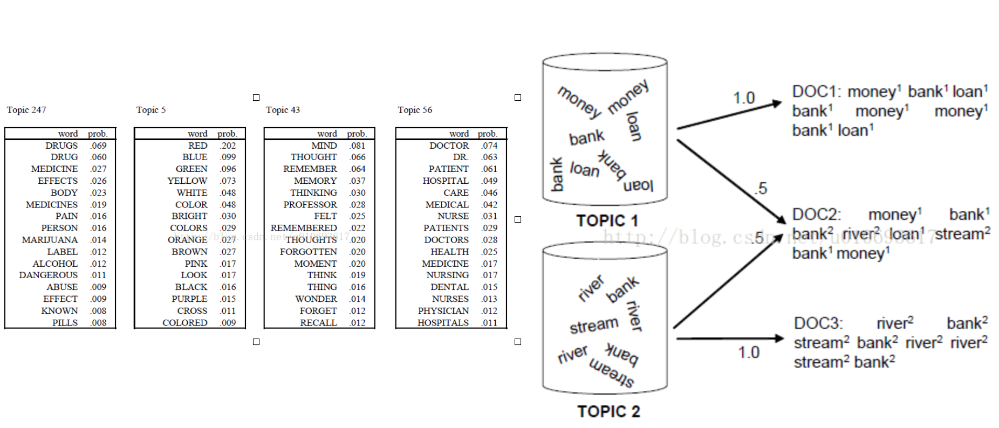

``` {r, include=FALSE}
knitr::opts_chunk$set(echo = TRUE, warning=FALSE, message=FALSE,
                    comment="", digits = 3, tidy = FALSE, prompt = FALSE, fig.align = 'center')

```


# 들어가며 [^topic-intro] {#nlp-topic-model}

[^topic-intro]: [Chris Bail (Duke University), "Topic Modeling"](https://cbail.github.io/SICSS_Topic_Modeling.html)

단어가 모이면 토픽이 되고, 토픽이 모이면 문서가 되는 방식을 상상하는 것이 필요하다.



**토픽(topic)**은 문서 모임을 추상화한 것으로 토픽을 듣게 되면 토픽을 구성할 단어를 어림 짐작할 수 있게 된다.
예를 들어, 전쟁이라고 하면 총, 군인, 탱크, 비행기 등이 관련된 단어로 연관된다.
여러 토픽이 모여서 문서가 되고, 문서는 여러 토픽을 담게 된다.

**토픽 모형(topci modeling)**은 문서로부터 모형을 적합시켜 토픽을 찾아내는 과정으로 정의할 수 있다.
토픽모형을 활용함으로써 문서를 분류하는데 종종 활용된다. 특히, LDA(Latent Dirichlet Allocation) 모형이 가장 많이 활용되고 있다.

## 작업흐름 {#nlp-topic-model}

자연어 텍스트에서 토픽모형을 개발하는 순서는 대략 다음과 같다.

1. 텍스트를 DTM을 변환시킨다.
    - 명사를 추출할 경우와, 동사를 추출할 경우로 나눠서 살펴볼 수도 있다.
1. LDA는 DTM을 입력값을 받아 문서별로 토픽에 대한 연관성을 나타내는 행렬과 토픽에 단어가 속할 확률 행렬을 출력값으로 반환한다.
    - 제어 매개변수(control parameter)를 적절히 설정한다.
1. 출력된 행렬은 세부적으로 정보를 확인할 때 필요하고 우선, 시각매체를 사용하여 시각화한다.
    - $\beta$ 행렬은 토픽에 단어가 포함될 확률
    - $\gamma$ 행렬은 문서에 토픽이 포함될 확률

## 헬로월드 {#nlp-topic-model-hello-world}

문장을 금융 관련 문서1, 문서2를 준비하고, 식당관련 문장을 문서3, 문서4로 준비한다.
문서5는 금융과 식당이 뒤섞이도록 준비한다.
이를 `topicmodels` 팩키지를 활용하여 `LDA` 분석작업을 수행한다.
그리고 나서 결과값을 문서-토픽 행렬로 표현하고 좀더 직관적으로 볼 수 있도록 `ggplot`으로 시각화한다.  

```{r nlp-topic-hello-world}
library(tidyverse)
library(tidytext)
library(RmecabKo)
library(topicmodels)

## 예제 데이터
sample_text <- c("부실 대출로 인해서 은행은 벌금을 지불하는데 동의했다",
                 "은행에 대출을 늦게 갚은 경우, 은행에서 지연에 대해 이자를 물릴 것이다.", 
                 "시내에 새로운 식당이 생겼습니다.",
                 "테헤란로에 맛집 식당이 있습니다.",
                 "새로 개장하려고 하는 식당 대출을 어떻게 상환할 계획입니까?")

sample_df <- tibble(
  document = paste0("문서", 1:5),
  text = sample_text
)

## BOW 데이터 변환
sample_bow <- sample_df %>% 
  mutate(nouns = map(text, nouns)) %>% 
  unnest(nouns) %>% 
  group_by(document) %>% 
  count(nouns, sort = TRUE)

## DTM 변환
sample_dtm <- sample_bow %>% 
  cast_dtm(document = document, term = nouns, value = n) %>% 
  as.matrix

## LDA 모형 적합
sample_lda <- LDA(sample_dtm, k = 2,  method="Gibbs", control=list(alpha=1, delta=0.1, seed=1357))

## 토픽 결과 - 행렬
tidy(sample_lda, matrix="gamma") %>% 
  arrange(document) %>% 
  spread(topic, gamma)

## 토픽 결과 - 시각화
### 문서 - 토픽

doc_topic_g <- tidy(sample_lda, matrix="gamma") %>% 
  mutate(topic = as.factor(topic)) %>% 
  ggplot(aes(x = document, y=gamma)) + 
    geom_col(aes(fill = topic), position=position_dodge()) +
    labs(title="금융, 식당 분류 토픽모형",
         subtitle = "문서 토픽 행렬")

### 토픽 - 단어
topic_word_g <- tidy(sample_lda, matrix="beta") %>% 
  ggplot(aes(x = term, y=beta)) + 
    geom_col(aes(fill=as.factor(topic)), position=position_dodge()) +
    labs(title="금융, 식당 분류 토픽모형",
         subtitle = "토픽 단어 행렬") +
    theme(axis.text.x = element_text(angle=90),
          legend.position = "none")

cowplot::plot_grid(doc_topic_g, topic_word_g)
```


