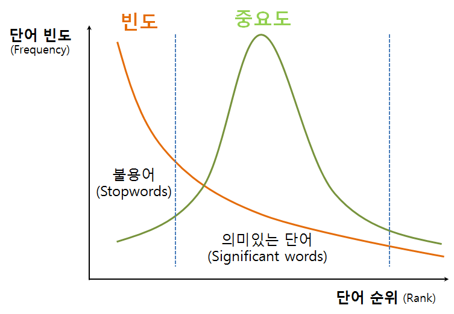

 
``` {r, include=FALSE}
source("tools/chunk-options.R")
knitr::opts_knit$set(verbose = FALSE, echo=FALSE, message=FALSE, warning =FALSE)
# 0. 환경설정 -----------
library(tidyverse)
library(rvest)
library(stringr)
library(purrr)
library(ggpubr)
library(extrafont)
loadfonts()
library(readxl)
library(rlang)
library(lubridate)
library(forcats)
library(lazyeval)
library(gridExtra)
```

## 1. 지프 법칙을 따르는 빈발 단어 [^wiki-zips-law] {#zipf-law-word} 

[^wiki-zips-law]: [위키 백과, 지프의 법칙](https://ko.wikipedia.org/wiki/%EC%A7%80%ED%94%84%EC%9D%98_%EB%B2%95%EC%B9%99)

지프 분포는 이산 멱법칙 확률분포와 관계된 확률분포의 하나로, 
수학적 통계를 바탕으로 밝혀진 경험적 법칙으로, 물리 및 사회 과학 분야에서 연구된 많은 종류의 정보들이 지프 분포에 가까운 경향을 보인다.

지프의 법칙의 가장 단순한 예는 “$\frac{1}{f}$ 함수”로, 
지프 분포를 따르는 빈도가 순위에 따라 정렬되어 주어졌을 때, 
2위에 해당하는 빈도는 1위의 빈도의 $\frac{1}{2}$이 된다. 3위의 빈도는 1위 빈도의 $\frac{1}{3}$이 된다. 이러한 방식으로, n위의 빈도는 1의 $\frac{1}{n}$이 된다.

즉, 단어 빈도는 단어의 빈도를 크기순으로 정렬했을 경우 빈도수와 순위는 반비례 관계가 존재한다.

$$\text{단어빈도}(f) \propto \frac{1}{\text{단어 순위}(R)}$$



## 2. 시군 인구 [^zipf-law-usa-city] {#zipf-city-population}

[^zipf-law-usa-city]: [Zipf’s Law for Cities](http://rstudio-pubs-static.s3.amazonaws.com/247714_39c2e657a6a14dbea0ff1585ac33ca6a.html)

지프 법칙을 도시크기가 따른 다는 것은 다수 연구를 통해서 많이 밝혀진 사항이다.
먼저 미국 도시 데이터를 위키사전 [List of Metropolitan Statistical Areas](https://en.wikipedia.org/wiki/List_of_Metropolitan_Statistical_Areas)에서 
가져온다. 데이터를 정제해서, 2016년 인구를 로그변환 시키고, 도시 순위도 로그 변환하여 회귀분석과 시각화준비를 마친다.

``` {r usa-population-zipf}
# # 0. 환경설정 -----------
# library(tidyverse)
# library(rvest)
# library(stringr)
# library(purrr)
# library(ggpubr)
# library(extrafont)
# loadfonts()

# 1. 데이터 가져오기 ---------
Sys.setlocale("LC_ALL", locale ="C")

url <- "https://en.wikipedia.org/wiki/List_of_Metropolitan_Statistical_Areas"

msa_dat <- read_html(url)%>% 
  html_nodes(xpath = '//*[@id="mw-content-text"]/div/table[2]') %>% 
  html_table(fill = TRUE) %>% 
  .[[1]] %>% 
  as_tibble()

Sys.setlocale("LC_ALL", locale ="Korean")

# 2. 데이터 정제 ---------

colnames(msa_dat) <- c("순위", "MSA", "인구2016", "인구2010", "변화율", "포함지역")

msa_df <- msa_dat %>% 
  mutate(city = str_extract(MSA, ".+?(?=-)")) %>% 
  mutate(rank = str_split(순위, "♠",2))  %>%
  mutate(인구2016 = as.numeric(str_replace_all(인구2016, ",", "")))  %>%
  unnest(rank) %>% 
  filter(row_number() %% 2 == 0) %>% 
  select(rank, city, 인구2016) %>% 
  mutate(rank = as.numeric(rank))

msa_df <- msa_df %>% 
  mutate(log_rank = log(rank),
         log_인구2016 = log(인구2016))
```

`lm` 회귀분석을 통해 회귀 계수가 **-1** 에 근접하는지 확인하고 더불어 이를 `ggplot`을 통해 시각화한다.

``` {r zipf-law-city-reg-ggplot}
# 3. 회귀분석 ---------

zipfreg <- lm(log_rank ~ log_인구2016, data = msa_df)
summary(zipfreg)

# 4. 시각화 ---------

ggplot(msa_df, aes(x=`log_인구2016`, y=log_rank)) +
  geom_point() +
  stat_smooth(method="lm", se=TRUE) +
  theme_pubr(base_family="NanumGothic") +
  labs(x="인구 2016 로그변환", y="로그 순위", title="미국 도시별 인구 Zipf 법칙 검증") 
```

## 3. 대한민국 시군 인구 [^sigun-population-reg] {#korean-city-population}

[^sigun-population-reg]: [시군 인구증가(2005-2016)](http://statkclee.github.io/parallel-r/ds-fp-population-by-sigun.html)

통계청에서 제공하는 연도별 인구데이터를 바탕으로 2005년부터 2016년까지 인구변동 데이터를 바탕으로 
시군별 인구변동에 대해 이해한다.

[국가통계포털, KOSIS](http://kosis.kr/)에서 "통계표" 검색창에 "도시지역 인구현황(시군구)" 입력하게 되면 
2005년부터 2016까지 시군구별 인구데이터를 받아올 수 있다. [직접 다운로드 링크](http://kosis.kr/statHtml/statHtml.do?orgId=315&tblId=TX_315_2009_H1001&vw_cd=&list_id=315_31502_008&seqNo=&lang_mode=ko&language=kor&obj_var_id=&itm_id=&conn_path=MT_ZTITLE)

인구변동이 많은 시군 통계 분석을 위해 필요한 팩키지를 불러 읽어온다.
통계청 KOSIS에서 다운로드 받은 파일을 `data` 폴더 아래 저장하고 나서, 전처리 작업을 수행한다.
서울특별시를 포함한 광역시에 포함된 군은 데이터 분석에 제외할 것이기 때문에 `stringr` 정규표현식 기능을 
활용하여 깔끔하게 향후 데이터분석을 위한 데이터프레임으로 정리한다.

``` {r korean-sigun-setup}
# 0. 환경설정 -----------
# library(tidyverse)
# library(rvest)
# library(stringr)
# library(purrr)
# library(readxl)
# library(ggpubr)
# library(extrafont)
# loadfonts()
# library(rlang)
# library(lubridate)
# library(forcats)
# library(lazyeval)
# library(gridExtra)

# 1. 데이터 가져오기 ---------

kor_dat <- read_excel("data/korea-pop-zipf-law.xlsx", sheet="데이터", skip=1) 

kor_dat <- kor_dat %>% 
  filter(`소재지(시군구)별` !="전국") %>% 
  filter(`인구현황별` =="전체인구(A)")

# 2. 데이터 전처리 ---------
## 2.1. 시군 뽑아내기 -------

sigungu_v <- kor_dat %>% count(`소재지(시군구)별`) %>% 
  pull(`소재지(시군구)별`)

sigungu_v <- sigungu_v[str_detect(sigungu_v, "시$|군$")]

## 2.2. 시군 데이터 전처리 -------

kor_df <- kor_dat %>% 
  filter(`소재지(시군구)별` %in% sigungu_v) %>% 
  filter(!is.na(`2016 년`)) %>% group_by(`소재지(시군구)별`) %>% 
  summarise_if(is.numeric, mean) %>% 
  rename(시군 = `소재지(시군구)별`)

names(kor_df) <- c("시군", paste0("y", str_replace_all(names(kor_df)[-1], " 년", "")))

## 2.3. 시각화 데이터 변환  -------
kor_lng_df <- kor_df %>% 
  gather(연도, 인구수, -시군) %>% 
  mutate(연도 = as.numeric(str_extract(연도, "[0-9]+")))
```

Adding Regression Line Equation and R2 on graph](https://stackoverflow.com/questions/7549694/adding-regression-line-equation-and-r2-on-graph)를
참조하여 회귀식도 `ggplot`에 함께 넣어 표식한다.

``` {r zipf-law-korean-city-visualization, fig.width=12}
# 3. Zipf 법칙 시각화 ------------------

convert_kor_log_pop <- function(df, var) {
  log_df <- kor_df %>% select_("시군", var) %>% 
    mutate_("임시인구" = var) %>% 
    arrange(desc(임시인구)) %>% 
    mutate_("순위" = ~ row_number()) %>% 
    mutate_("로그_순위" = ~ log(순위+1)) %>% 
    mutate_("로그_인구" = ~log(임시인구))
  
  kor_zipf_reg <- lm(로그_순위 ~ 로그_인구, data = log_df)
  kor_zipf_reg
  
  lm_eqn <- function(df){
    m <- lm(로그_순위 ~ 로그_인구, data = df);
    eq <- substitute(italic(y) == a + b %.% italic(x)*","~~italic(r)^2~"="~r2, 
                     list(a = format(coef(m)[1], digits = 2), 
                          b = format(coef(m)[2], digits = 2), 
                          r2 = format(summary(m)$r.squared, digits = 3)))
    as.character(as.expression(eq));                 
  }

  ggplot(log_df, aes(x=로그_인구, y=로그_순위)) +
    geom_point() +
    stat_smooth(method="lm", se=TRUE) +
    theme_pubr(base_family="NanumGothic") +
    labs(x="로그 인구", y="로그 순위", title=paste0("시군인구 Zipf 법칙 검증: ", str_extract(var, "[0-9].+"), "년")) +
    geom_text(x = 14, y = 5, label = lm_eqn(log_df), parse = TRUE)
}

zipf_2005_g <- convert_kor_log_pop(kor_df, "y2005")
zipf_2010_g <- convert_kor_log_pop(kor_df, "y2010")
zipf_2016_g <- convert_kor_log_pop(kor_df, "y2016")

grid.arrange(zipf_2005_g, zipf_2010_g, zipf_2016_g, nrow=1)
```


