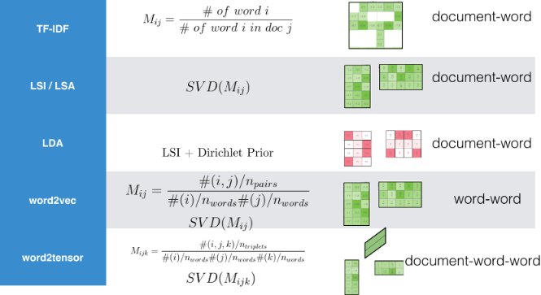

```{r setup, include=FALSE}
knitr::opts_chunk$set(echo = TRUE, message=FALSE, warning=FALSE,
                      comment="", digits = 3, tidy = FALSE, prompt = FALSE, fig.align = 'center')

library(pdftools)
library(tidyverse)
library(magick)

```


# 워드 임베딩(Word Embedding)으로 여정 [^julia-word-embedding] {#word-embedding}

[^julia-word-embedding]: [Julia Silge (2020-06-04), "Understanding Word Embeddings", Why R Webinar](https://juliasilge.github.io/why-r-webinar/)


## 데이터셋 {#customer-complaints}

우리로 치자면 소비자 보호원 격인
[Consumer Financial Protection Bureau, "Consumer Complaint Database"](https://www.consumerfinance.gov/data-research/consumer-complaints/) 웹사이트에 등록된 고객 불만접수가 데이터베이스로 제공되고 있다. `.csv`파일로 잘 정제가 되어있어 이를 다운로드 받아 살펴보자. 압축을 풀면 1GB정도로 다소 데이터크기가 크다. 

```{r word-embedding}
library(tidyverse)
library(tidytext)

## 데이터셋: 소비자 불만
complaints <- read_csv("data/complaints.csv")

glimpse(complaints)
```

데이터가 크다보니 10% 표본만을 대상으로 작업을 속도감있게 진행하고 중요하다고 생각되는 변수만 우선적으로 추출하여 후속작업을 진행한다.

```{r word-embedding-dataset}
set.seed(777)

complaints_dat <- complaints %>% 
  janitor::clean_names() %>% 
  select(complaint_id, consumer_complaint_narrative, product, company, date_received) %>% 
  sample_frac(0.1) %>% 
  drop_na()

complaints_dat
```

## 텍스트도 데이터다! {#word-embedding-data}

텍스트는 과거 통계학에서 다루는 영역은 아니었으나, 데이터 과학으로 영역을 확대하여 텍스트도 당연히 데이터로 다뤄지게 되었다. 고객불만 텍스트가 상당히 긴 경우가 있으니 `str_trunc()` 함수로 100자까지로 한정시켜 보자.

```{r word-embedding-dataset-text}
complaints_dat %>% 
  sample_n(5) %>% 
  mutate(complain_text = str_trunc(consumer_complaint_narrative, 100, side = "left")) %>% 
  pull(complain_text)
```

## 텍스트 &rarr; 데이터프레임 {#word-embedding-dataframe}

고객 불만에 대한 텍스트를 데이터프레임으로 변환시킨다. 이를 위해서 토큰화를 하고 영어의 경우 불용어(stopwords)를 제거하고 `wordStem()` 함수를 사용해서 어근(stem)만 추출하고 이를 Document-Feature Matrix(DFM)을 만들어서 후속 분석작업을 수행한다.

```{r word-embedding-dataframe}
library(SnowballC)
library(quanteda)
library(stopwords)

complaints_df <- complaints_dat %>% 
  unnest_tokens(word, consumer_complaint_narrative) %>% 
  anti_join(get_stopwords()) %>%  
  mutate(stem = wordStem(word)) %>% 
  count(complaint_id, stem) %>%  
  bind_tf_idf(stem, complaint_id, n) %>% 
  cast_dfm(complaint_id, stem, tf_idf)

complaints_df
```

# 워드 임베딩 [^create-word-embedding] {#word-embedding-r}

[^create-word-embedding]: [Moody, Chris. "Stop using word2vec." MultiThreaded blog (2017).](https://multithreaded.stitchfix.com/blog/2017/10/18/stop-using-word2vec/)

인접한 단어를 통해 상당히 많은 정보를 얻을 수 있게 된다. 
사실 한국어는 다소 차이가 있을 수 있지만, 영어의 경우는 [John Rupert Firth](https://en.wikipedia.org/wiki/John_Rupert_Firth)의 문장을 인용할 수 있고, 이를 50년도 지나 구현한 것이 워드 임베딩 모형이라고 볼 수 있다. 한국어도 유사한 의미를 갖는 단어는 문서에서 근처에 존재할 것이라는 가정은 나름 합리적으로 받아들일 수 있다.

> You shall know a word by the company it keeps. <br>
> - John Rupert Firth

- [`word2vec`](https://github.com/dselivanov/text2vec)
- GloVe
- [fastText](https://fasttext.cc/)
- `transformer` 언어모형: BERT, ULMFiT, ELMo

```{r download-word2vec-figure, eval - FALSE}
webshot2::webshot(url = "https://multithreaded.stitchfix.com/blog/2017/10/18/stop-using-word2vec/", selector = "body > div.container.contain-to-sm.pos-rel > article > section > footer > ol > li:nth-child(1) > img", file = "fig/stop-using-word2vec.png")
```

무거운 딥러닝 `Word2Vec` 대신 로컬 컴퓨터로 간단히 구현할 수 있는 알고리즘이 존재한다. 다소 차이는 있을지 모르지만 현업에서 사용하는데는 크게 무리가 없을 듯 싶다.



# Pre-trained 워드 임베딩 {#word-embedding-pre-trained}

사전 훈련된 워드 임베딩(Pre-trained Word-Embedding) 모형은 학습시킬 충분한 데이터가 없는 경우 유용하게 사용될 수 있다. 

[`textdata`](https://github.com/EmilHvitfeldt/textdata) 팩키지를 통해서 텍스트 관련 데이터를 라이선스 걱정(?)없이 동의과정을 거쳐 수월하게 작업을 진행할 수 있다. `textdata` 팩키지를 통해 얻을 수 있는 Pre-trained 모형을 살펴보자.

```{r textdata-table}
library(rvest)

read_html("https://github.com/EmilHvitfeldt/textdata") %>% 
  html_nodes(css = "#readme > div.Box-body.px-5.pb-5 > article > table") %>% 
  html_table() %>% 
  .[[1]] %>% 
  knitr::kable()
```

`embedding_glove6b()` 함수를 사용해서 단어를 100차원으로 축소해서 살펴보자.

```{r pretrained-text-data}
library(textdata)

glove6b <- embedding_glove6b(dimensions = 100)

glove6b
```

단어-차원(100) 행렬을 깔끔한 데이터프레임형태로 정리한다.

```{r pretrained-glove-vector}
tidy_glove <- glove6b %>% 
  pivot_longer(contains("d"), 
             names_to = "dimension") %>% 
  rename(item1 = token)

tidy_glove
```

`nearest_neighbors()` 함수를 사용해서 특정 단어와 연관된 단어를 찾아낼 수 있다.

```{r pretrained-glove-vector-check}
library(widyr)

nearest_neighbors <- function(df, token) {
  df %>%
    widely(~ . %*% (.[token, ]), 
           sort = TRUE, 
           maximum_size = NULL)(item1, dimension, value) %>%
    select(-item2)
}

tidy_glove %>% 
  nearest_neighbors("king")
```