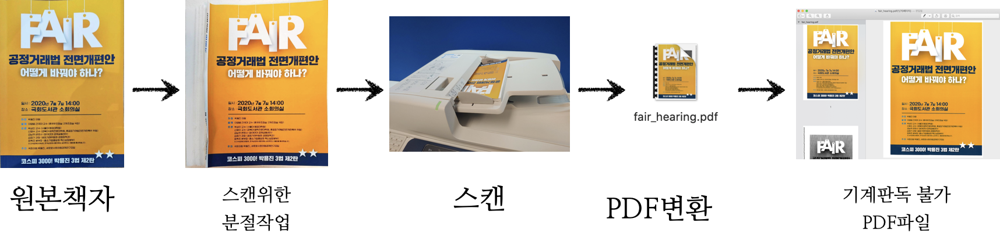

```{r setup, include=FALSE}
knitr::opts_chunk$set(echo = TRUE, message=FALSE, warning=FALSE,
                      comment="", digits = 3, tidy = FALSE, prompt = FALSE, fig.align = 'center')

library(pdftools)
library(tidyverse)
library(magick)
```


# 공정거래법 국회공청회 [^fair-hearing] {#fair-parliment}

[^fair-hearing]: [한정렬 2020.07.07 10:44, "더민주당 박용진, 오후2시 '공정거래법' 개편안 토론회 개최", 데일리메디팜](http://www.dailymedipharm.com/news/articleView.html?idxno=51894)

더민주당 박용진 국회의원(강북을)은 7일 오후 2시 국회도서관 소회의실에서 '공정거래법 전면개편안 어떻게 바꿔야 하나?'토론회를 개최했다. 공청회 진행 시 배부된 책자를 받아 Digitization 과정을 거쳐 텍스트 마이닝을 거쳐 MRC 작업을 수행해보자.

# Digitization 작업 {#digitization-workflow}

배부된 책자를 원활히 스캔하기 위해서 분책하는 과정을 거친다. 그리고 나서 스캐너에 넣어 배부집 전체를 스캔한다. 스캔된 결과는 파일이 크지만 600 DPI로 Digitization 과정을 거쳐 PDF 파일로 저장한다. 



PDF 파일을 PNG로 변환시켜 직접 살펴보기 위한 준비작업을 수행한다.

```{r fair-law, eval = FALSE}
library(pdftools)
library(tidyverse)
library(magick)

# 공청회 배부집 PDF 파일정보, 총페이지수
fair_pdf_info <- pdf_info("data/fair_hearing.pdf")

dir.create("fig/fair")

# PDF 파일 PNG  변환
pdf_convert("data/fair_hearing.pdf", pages = 1:fair_pdf_info$pages, filename = glue::glue("fig/fair/fair_{1:fair_pdf_info$pages}.png"))
```

`slickR`에 태우기 위해 데이터프레임 변환과정을 거쳐 빠르게 공정거래법 전면개편안을 살펴볼 수 있도록 작업한다.

```{r fair-law-merry-go-round}
library(slickR)

fair_png <- list.files("fig/fair")
fair_pdf_df <- tibble(page = glue::glue("fig/fair/{fair_png}") )
  
bottom_opts <- settings(arrows = TRUE,
                        slidesToShow = 3,
                        slidesToScroll = 1,
                        centerMode = TRUE, 
                        focusOnSelect = TRUE,
                        initialSlide = 0)

slickR(fair_pdf_df$page, height = 600) %synch% 
  (slickR(fair_pdf_df$page, height = 100) + bottom_opts)
```

