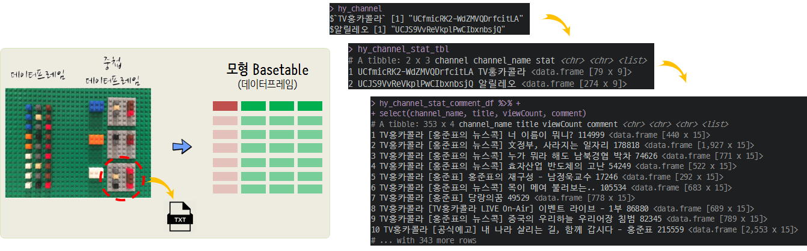

 
``` {r, include=FALSE}
# source("tools/chunk-options.R")

knitr::opts_chunk$set(echo = TRUE, warning=FALSE, message=FALSE,
                    comment="", digits = 3, tidy = FALSE, prompt = FALSE, fig.align = 'center')

library(tuber)
library(tidyverse)

```

# 유튜브 댓글 분류기 {#red-vs-blue}

[TV 홍카콜라](https://www.youtube.com/channel/UCfmicRK2-WdZMVQDrfcitLA)와 
[유시민의 알릴레오](https://www.youtube.com/channel/UCJS9VvReVkplPwCIbxnbsjQ)에 달린 댓글을 바탕으로 댓글만 보고
"TV 홍카콜라" 채널에 달릴 댓글인지 "유시민의 알릴레오"에 달릴 댓글인지 예측하는 예측모형을 제작해 보자.

가장 먼저 동영상별로 댓글 자료구조를 준비한다. 
그리고 나서 댓글을 예측모형 `Basetable` 데이터프레임으로 준비하는 과정을 거친고 나서 
나이브 베이즈 혹은 GLM 모형을 적합시켜 예측모형을 제작해 나가는 과정을 거친다.


# 유튜브 트래픽 {#red-vs-blue-traffic}

## 데이터 가져오기  {#red-vs-blue-traffic-data}

[TV 홍카콜라](https://www.youtube.com/channel/UCfmicRK2-WdZMVQDrfcitLA)와 
[유시민의 알릴레오](https://www.youtube.com/channel/UCJS9VvReVkplPwCIbxnbsjQ)에서 채널 고유값을 가져온다.
이를 데이터프레임으로 만들고 채널고유값을 `tuber` 팩키지 `get_all_channel_video_stats()` 함수에 넣어 유튜브 채널 트래픽 데이터를 불러와서 저장시킨다.

```{r red-vs-yoo-traffic-data, eval=FALSE}
library(tuber)
library(tidyverse)

yt_oauth(yt_app_id, yt_app_pw)

hy_channel <- list("TV홍카콜라" = "UCfmicRK2-WdZMVQDrfcitLA",
                   "알릴레오"   = "UCJS9VvReVkplPwCIbxnbsjQ")

# 1. 데이터 가져오기 -----
## 1.1 유튜브 채널 통계 -----
hy_channel_tbl <- tibble(channel = hy_channel %>% unlist, channel_name = names(hy_channel), stat =NA)
 
hy_video_stat_tbl <- map_df(hy_channel_tbl$channel, get_all_channel_video_stats)

hy_channel_stat_tbl <- hy_channel_tbl %>% 
  mutate(stat = map(hy_channel_tbl$channel, get_all_channel_video_stats)) 

hy_channel_stat_tbl %>% write_rds("data/hy_channel_stat_tbl.rds")
```


## 채널 트래픽 비교 {#red-vs-blue-traffic-comparison}

TV홍카콜라 첫방송이 "2018-12-18" "이 남자, 돌아온다."라는 티져를 시작으로 본격적으로 방송이 되어 알릴레오와 최대한 유사한 비교 조건을 만든다. "2019-02-01" 시점기준으로 얼추 유사한 동영상 갯수임을 확인할 수 있다.


```{r red-vs-yoo-traffic}
library(lubridate)

hy_channel_stat_tbl <- read_rds("data/hy_channel_stat_tbl.rds")

hy_channel_stat_tbl

hy_channel_stat_df <- hy_channel_stat_tbl %>% 
  unnest(stat) %>% 
  mutate_at(vars(contains("Count")), as.integer)

hy_channel_stat_df %>% 
  mutate(date = ymd_hms(publication_date)) %>% 
  filter(date >= ymd("2018-01-19")) %>% 
  group_by(channel_name) %>% 
  summarise(video_count         = n(),
            max_viewCount       = max(viewCount, na.rm = TRUE),
            mean_viewCount      = mean(viewCount, na.rm = TRUE),
            median_viewCount    = median(viewCount, na.rm = TRUE),
            max_likeCount       = max(likeCount, na.rm = TRUE),
            mean_likeCount      = mean(likeCount, na.rm = TRUE),
            median_likeCount    = median(likeCount, na.rm = TRUE),
            max_dislikeCount    = max(dislikeCount, na.rm = TRUE),
            mean_dislikeCount   = mean(dislikeCount, na.rm = TRUE),
            median_dislikeCount = median(dislikeCount, na.rm = TRUE),
            max_commentCount    = max(commentCount, na.rm = TRUE),
            mean_commentCount   = mean(commentCount, na.rm = TRUE),
            median_commentCount = median(commentCount, na.rm = TRUE)) %>% 
  gather(metric, value, -channel_name) %>% 
  spread(channel_name, value) %>% 
  DT::datatable() %>% 
    DT::formatRound(c(2:3), digits = 0)
```


## 조회수 &rarr; 좋아요 전환 {#red-vs-blue-traffic-conversion}

조회수 대비 좋아요 전환은 "TV홍카콜라"가 "알릴레오"에 비해 더 높은 것으로 나타나지만,
파괴력면에서는 "알릴레오"가 "TV홍카콜라"를 넘어서는 것으로 파악된다.

```{r red-vs-yoo-traffic-conversion}
library(extrafont)
loadfonts()

hy_channel_stat_df %>% 
  ggplot(aes(x=viewCount, y=likeCount, color=channel_name)) +
    geom_point() +
    geom_smooth() +
    scale_x_sqrt(labels = scales::comma) +
    scale_y_sqrt(labels = scales::comma) +
    labs(x="조회수", y="좋아요수", title="조회수와 좋아요수 관계", 
         subtitle="유튜브 TV홍카콜라와 알릴레오 채널", color="유튜브 채널명") +
    theme_minimal(base_family = "NanumGothic") +
    theme(legend.position = "right")
```


## 유튜브 채널별 동영상 상세 {#red-vs-blue-video-detail}

조회수 대비 좋아요 전환은 "TV홍카콜라"가 "알릴레오"에 비해 더 높은 것으로 나타나지만,
파괴력면에서는 "알릴레오"가 "TV홍카콜라"를 넘어서는 것으로 파악된다.

```{r red-vs-yoo-traffic-detail}
hy_channel_stat_df %>% 
  mutate(publication_date = as.Date(publication_date)) %>% 
  mutate(id = paste0("<a href=https://www.youtube.com/watch?v=", id,">", id,"</a>")) %>% 
  arrange(desc(viewCount)) %>% 
  select(-channel, `채널`=channel_name, `동영상`=id, date=publication_date, -favoriteCount, -url) %>% 
  DT::datatable(escape=FALSE, options = list(scrollX=TRUE, autoWidth = TRUE,
                                         columnDefs = list(list(width = '300px', targets = c(3))))) %>% 
  DT::formatCurrency(c("viewCount", "likeCount", "dislikeCount", "commentCount"), currency = "", digits = 0) 
```


# 유튜브 채널 자연어처리 {#red-vs-blue-video-nlp-detail}

## 유튜브 채널 댓글 데이터 {#red-vs-blue-video-nlp-import}

`tuber` 팩키지 `get_all_comments()` 함수를 사용해서 댓글을 가져온다.
문제는 댓글이 없는 경우 오류가 생기기 때문에 `possibly()`를 사용해서 오류가 나더라도 후속작업을 진행시킨다.

```{r red-vs-yoo-traffic-nlp-data, eval=FALSE}
library(tictoc)

# 1. 함수형 프로그래밍 동영상 댓글 -----
get_all_comments_possibly <- possibly(get_all_comments, otherwise = NULL)

tic()
hy_video_comment_list <- map(hy_video_stat_tbl$id, get_all_comments_possibly)
toc()

# 1641.46 sec elapsed

hy_video_comment_df <- hy_video_stat_tbl %>% 
  mutate(comment = hy_video_comment_list)

hy_video_comment_list %>% 
  write_rds("data/hy_video_comment_list.rds")
```


## 댓글 데이터 자료형 {#red-vs-blue-video-nlp-wrangling}

트래픽 데이터프레임과 댓글 데이터프레임을 두 유튜브 채널별로 결합시켜 예측모형 개발에 필요한 데이터구조를 만들어낸다.



```{r red-vs-yoo-traffic-nlp-wrangling}
hy_video_comment_list <- read_rds("data/hy_video_comment_list.rds")

hy_channel_stat_df <- hy_channel_stat_tbl %>% 
  unnest(stat)

hy_channel_stat_comment_df <- hy_channel_stat_df %>% 
  mutate(comment = hy_video_comment_list)

hy_channel_stat_comment_df %>% 
  select(channel_name, title, viewCount, comment)
```


# 자연어 없는 예측모형 {#red-vs-blue-video-classify-wo-nlp}

## 예측모형 데이터 {#red-vs-blue-video-classify-wo-nlp-data}

예측모형 구축을 위해 표본 구성을 맞춘다. 즉, 클래스 불균형을 맞추고 시점도 맞추기 위해서 "2018-01-19" 이후로 TV홍카콜라와 알릴레오를 동영상 구성을 맞추고 `publication_date`에서 날짜 `feature`만  일부 추출하여 `Basetable` 모형데이터를 준비시킨다.

```{r red-vs-yoo-traffic-nlp-caret-data}
hy_rect_basetable <- hy_channel_stat_comment_df %>% 
  mutate(date = ymd_hms(publication_date)) %>% 
  filter(date >= ymd("2018-01-19")) %>% 
  select(channel_name, contains("Count"), date=publication_date) 

hy_rect_basetable <- hy_rect_basetable %>% 
  mutate(y = ifelse(channel_name == "TV홍카콜라", 0L, 1L) %>% factor(., levels=c(0, 1), labels = c("홍카콜라", "알릴레오") )) %>% 
    mutate_at(vars(contains("Count")), as.integer) %>% 
    mutate(date = ymd_hms(date)) %>% 
    mutate(month = month(date) %>% as.factor,
           week = weekdays(date) %>%  as.factor) %>% 
    select(y, contains("Count"), month, week) %>% 
    mutate(month = case_when(month == 1 ~ "1월",
                             month ==12 ~ "12월",
                             TRUE ~ "기타")) %>% 
    mutate(commentCount = ifelse(is.na(commentCount), 0, commentCount))
  
hy_rect_basetable
```


## 예측모형 개발 [^tidyverse-model] {#red-vs-blue-video-classify-wo-nlp-fit}

[^tidyverse-model]: [데이터 과학 – 모형](https://statkclee.github.io/model/)

`caret` 팩키지를 사용해서 예측모형을 개발하고 성능을 파악한다.

```{r red-vs-yoo-traffic-nlp-caret-fit}
library(caret)

# 2. 예측모형 -----
## 2.1. 훈련/시험 데이터 분할 ------

y_index <- createDataPartition(hy_rect_basetable$y, times =1, p=0.7, list=FALSE)

train_df <- hy_rect_basetable[y_index, ]
test_df  <- hy_rect_basetable[-y_index, ]

## 2.2. 모형 개발/검증 데이터셋 준비 ------

cv_folds <- createMultiFolds(train_df$y, k = 10, times = 3)

cv_cntrl <- trainControl(method = "repeatedcv", number = 10,
                        repeats = 3, index = cv_folds)


## 2.2. 모형 개발/검증 데이터셋 준비 ------

library(doSNOW)
library(tictoc)
# 실행시간
tic()

cl <- makeCluster(4, type = "SOCK")
registerDoSNOW(cl)

hy_rpart <- train(y ~ ., data = train_df, 
                   method = "rpart", 
                   trControl = cv_cntrl, 
                   preProcess = c("nzv", "center", "scale", "spatialSign"),
                   tuneLength = 7)

hy_glm   <- train(y ~ ., data = train_df, 
                   method = "glm",
                   family = "binomial",
                   trControl = cv_cntrl, 
                   preProcess = c("nzv", "center", "scale", "spatialSign"),
                   tuneLength = 7)

hy_rf    <- train(y ~ ., data = train_df, 
                  method = "rf",
                  trControl = cv_cntrl, 
                  preProcess = c("nzv", "center", "scale", "spatialSign"),
                  tuneLength = 7,
                  importance = TRUE)

stopCluster(cl)
toc()

# 4. 모형 비교평가-----
model_list <- list(
  rpart = hy_rpart,
  glm   = hy_glm,
  rf    = hy_rf
)

resamps <- resamples(model_list)
summary(resamps)

dotplot(resamps)


# 5. 모형성능 평가 -----
hy_pred_class <- predict(hy_rf, newdata = test_df)
## 혼동행렬 -----
confusionMatrix(hy_pred_class, test_df$y)
```


# 댓글 자연어 데이터 분석 [^nlp4kec] {#red-vs-blue-video-classify-w-nlp-eda}

[^nlp4kec]: [NLP4kec, "은전한닢 형태소 분석기"](https://github.com/NamyounKim/NLP4kec)

## 댓글 제목 {#red-vs-blue-video-classify-w-nlp-title}

`NLP4kec` 팩키지를 활용해서 유튜브 제목을 형태소분석하여 이를 `tidytext` 작업흐름에 맞춰 빈도수 분석을 한다.


```{r red-vs-yoo-traffic-nlp-caret-bow}
# install.packages("C:/Users/chongmu/Downloads/NLP4kec_1.2.0.zip", repos=NULL)
library(NLP4kec)
library(extrafont)
loadfonts()

hy_bow_df <- hy_channel_stat_comment_df %>% 
  select(channel_name, title) %>% 
  mutate(bow = r_parser_r(title, language = "ko", useEn = TRUE))

hy_bow_tidy_df <- hy_bow_df %>% 
  mutate(bow = map(bow, str_split, pattern=" ") ) %>% 
  select(channel_name, title, bow) %>% 
  unnest(bow) %>% 
  unnest(bow)

hy_bow_tidy_df %>% 
  count(channel_name, bow, sort=TRUE) %>% 
  filter(bow != "",
         channel_name == "TV홍카콜라") 

hy_bow_tidy_df %>% 
  count(channel_name, bow, sort=TRUE) %>% 
  filter(bow != "") %>% 
  group_by(channel_name) %>% 
  top_n(20, wt=n) %>% 
  ungroup() %>% 
  ggplot(aes(x=fct_reorder2(bow, channel_name, -n), y=n, fill=channel_name)) +
    geom_col() +
    coord_flip() +
    facet_wrap(~channel_name, scales = "free") +
    labs(title="TV홍카콜라 vs 알릴레오 고빈도 용어 20선",
         subtitle="유튜브 채널",
         x="", y="") +
    theme_light(base_family="NanumGothic") +
    theme(legend.position = "none") 
```


# 댓글 사용자 네트워크 분석 {#red-vs-blue-video-classify-w-network}


```{r red-vs-yoo-traffic-comment}

```

