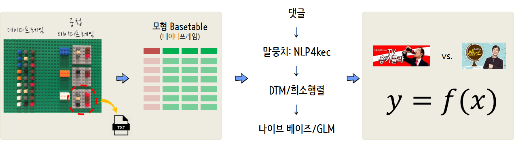

 
``` {r, include=FALSE}
# source("tools/chunk-options.R")

knitr::opts_chunk$set(echo = TRUE, warning=FALSE, message=FALSE,
                    comment="", digits = 3, tidy = FALSE, prompt = FALSE, fig.align = 'center')

```

# 유튜브 댓글 분류기 {#red-vs-blue}

[TV 홍카콜라](https://www.youtube.com/channel/UCfmicRK2-WdZMVQDrfcitLA)와 
[유시민의 알릴레오](https://www.youtube.com/channel/UCJS9VvReVkplPwCIbxnbsjQ)에 달린 댓글을 바탕으로 댓글만 보고
"TV 홍카콜라" 채널에 달릴 댓글인지 "유시민의 알릴레오"에 달릴 댓글인지 예측하는 예측모형을 제작해 보자.

가장 먼저 동영상별로 댓글 자료구조를 준비한다. 
그리고 나서 댓글을 예측모형 `Basetable` 데이터프레임으로 준비하는 과정을 거친고 나서 
나이브 베이즈 혹은 GLM 모형을 적합시켜 예측모형을 제작해 나가는 과정을 거친다.



# 유튜브 트래픽 {#red-vs-blue-traffic}

## 데이터 가져오기  {#red-vs-blue-traffic-data}

[TV 홍카콜라](https://www.youtube.com/channel/UCfmicRK2-WdZMVQDrfcitLA)와 
[유시민의 알릴레오](https://www.youtube.com/channel/UCJS9VvReVkplPwCIbxnbsjQ)에서 채널 고유값을 가져온다.
이를 데이터프레임으로 만들고 채널고유값을 `tuber` 팩키지 `get_all_channel_video_stats()` 함수에 넣어 유튜브 채널 트래픽 데이터를 불러와서 저장시킨다.

```{r red-vs-yoo-traffic}
library(tuber)
library(tidyverse)

yt_oauth(yt_app_id, yt_app_pw)

hy_channel <- list("TV홍카콜라" = "UCfmicRK2-WdZMVQDrfcitLA",
                   "알릴레오"   = "UCJS9VvReVkplPwCIbxnbsjQ")

# 1. 데이터 가져오기 -----
## 1.1 유튜브 채널 통계 -----
hy_channel_tbl <- tibble(channel = hy_channel %>% unlist, channel_name = names(hy_channel), stat =NA)
 
hy_video_stat_tbl <- map_df(hy_channel_tbl$channel, get_all_channel_video_stats)

hy_channel_stat_tbl <- hy_channel_tbl %>% 
  mutate(stat = map_df(hy_channel_tbl$channel, get_all_channel_video_stats))

hy_video_stat_tbl %>% write_rds("data/hy_video_stat_tbl.rds")
```


## 채널 트래픽 비교 {#red-vs-blue-traffic-comparison}


```{r red-vs-yoo-traffic}
hy_video_stat_tbl
```
